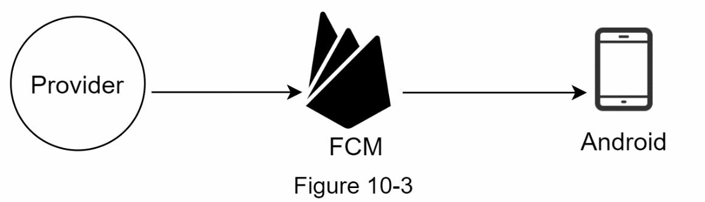

# Chapter 10: 알림 시스템 설계
### Step 1 - 문제 이해 및 범위 정의

---

## 목표
하루에 **수백만 건의 알림**을 실시간 또는 예약 방식으로 사용자에게 전송할 수 있는 **확장 가능한 알림 시스템**을 설계 

지원되는 알림 유형:
- **모바일 푸시 알림**
- **SMS 문자 메시지**
- **이메일**

---

## 요구사항 요약

### 모바일 푸시 알림, SMS, 이메일

### **소프트 실시간 시스템**
- 가능한 한 빠르게 알림을 전송
- 하지만 시스템에 부하가 있는 경우 **약간의 지연은 허용**

### 지원 기기
- iOS (Apple Push Notification Service - APNS)
- Android (Firebase Cloud Messaging - FCM)
- 데스크탑/노트북 (이메일 및 웹 푸시)

### 이벤트 타입
- **클라이언트에서 발생하는 실시간 이벤트** (예: 누군가 내 게시물에 좋아요를 누름)
- **서버 측 예약 이벤트** (예: 매일 아침 뉴스 요약, 프로모션)

### 알림 거부 여부
- 사용자는 **알림 수신 여부 및 채널 선택**이 가능
- 시스템은 반드시 사용자의 **수신 거부 설정을 준수**

### Q: 예상되는 시스템 규모

- 하루 **1천만 건** 푸시 알림
- 하루 **500만 건** 이메일
- 하루 **100만 건** SMS

---

## 요구사항 요약

| 항목                     | 세부 내용                                                         |
|--------------------------|--------------------------------------------------------------------|
| 알림 유형                | 푸시 알림, SMS, 이메일                                            |
| 지원 기기                | iOS, Android, 데스크탑                                            |
| 알림 발생 방식           | 실시간(클라이언트 트리거), 예약(서버 스케줄링)                   |
| 전송 보장 수준           | 소프트 실시간 (최대한 빠르게, 부하 시 약간 지연 허용)             |
| 사용자 알림 설정         | 채널별 수신 동의/거부 가능                                         |
| 규모                     | 총 약 **1,600만 건** 알림/일 전송                                 |

---

## 다음 단계

- 이벤트 수신기 (Event Ingestion)
- 알림 스케줄러 (Notification Scheduler)
- 사용자 설정 서비스 (User Preferences Service)
- 채널별 핸들러 (푸시, SMS, 이메일)
- 전송 제한 및 재시도 시스템 (Throttling & Retry)
- 로깅 및 모니터링 (Logging & Monitoring)

# Step 2 - 상위 수준 설계 제안 및 동의 얻기

## 다양한 알림 방식

### iOS 푸시 알림

iOS 알림을 보내기 위해 필요한 구성 요소:
- **Provider**: APNS(Apple Push Notification Service)에 알림 요청을 생성하고 전송
    - Device Token: 고유한 디바이스 식별자
    - Payload(JSON):
      
- **APNS**: Apple의 푸시 전송 서비스
- **iOS 디바이스**: 최종 수신 클라이언트

---

### Android 푸시 알림

- **Firebase Cloud Messaging (FCM)** 사용
- FCM은 Android 디바이스로 푸시 알림 전송

---

### SMS

- Twilio, Nexmo 등 서드파티 SMS 서비스 사용
- 대부분 상용 유료 서비스

---

### 이메일

- 자체 서버 운영 가능하나, 일반적으로 SendGrid, Mailchimp 등 상용 서비스 사용
- 이유: 높은 전달률, 분석 도구 제공

---

## 연락처 정보 수집 흐름

- 사용자로부터 수집하는 정보:
    - 이메일 주소
    - 전화번호
    - 디바이스 토큰

### 수집 흐름
1. 앱 설치 또는 회원가입 시 API 서버가 정보 수집
2. DB에 저장

### 데이터베이스 구조

- `user` 테이블: 이메일, 전화번호 저장
- `device` 테이블: 디바이스 토큰 저장 (1명의 사용자가 여러 디바이스 가질 수 있음)

---

## 알림 발송 흐름

### 초기 설계 (단순 구조)

1. **Service 1~N**: 알림을 트리거하는 다양한 서비스들
2. **Notification Server**: API 제공, 메시지 생성, 제3자 서비스 호출
3. **서드파티 서비스**: APNS, FCM, Twilio, SendGrid 등
4. **사용자 디바이스**: 알림 수신

### 문제점

- 단일 장애 지점(SPOF)
- 확장성 부족
- 성능 병목 발생 가능

---

## 개선된 설계 (고급 구조)

### 개선 요소

- DB와 캐시를 알림 서버 외부로 분리
- 다수의 알림 서버로 수평 확장
- **메시지 큐** 도입으로 컴포넌트 분리 및 비동기 처리

---

### 전체 흐름

1. **서비스(Service 1~N)**:
    - 내부 전용 API 호출로 알림 요청
2. **알림 서버(Notification Server)**:
    - 유효성 검사 수행
    - 사용자 정보, 디바이스 토큰, 알림 설정 DB/캐시에서 조회
    - 메시지 큐에 이벤트 등록
3. **캐시 / DB**:
    - 캐시: 템플릿, 사용자 정보 등 자주 조회되는 데이터 저장
    - DB: 사용자, 알림 설정, 로그 저장
4. **메시지 큐**:
    - 알림 유형별 큐(iOS, Android, SMS, 이메일)
    - 버퍼 역할 수행
5. **워커(Worker)**:
    - 큐에서 이벤트를 꺼내 외부 서비스로 전송
6. **서드파티 서비스**:
    - 실제 알림 전송 수행
7. **사용자 디바이스**:
    - 알림 수신

---
# Step 3 - 설계 심화 분석

## 신뢰성 (Reliability)

### 데이터 손실 방지

- 모든 알림 데이터는 **DB에 영구 저장**
- **재시도 메커니즘**을 통해 실패한 알림 재전송
- **알림 로그 DB**를 통해 내역 추적 가능

### 중복 방지
알림이 **정확히 한 번만** 전송되는 것은 이상적이지만, 분산 시스템 특성상 중복 전송 가능성 존재.

- **event ID** 기반으로 중복 검사
- 이미 처리된 이벤트는 무시, 처음인 경우만 전송
- 완전한 'exactly-once' 보장은 불가능하지만 **최대한 중복 감소** 목표

---

## 추가 컴포넌트 및 고려 사항

### 알림 템플릿 (Notification Template)

반복되는 알림 포맷을 줄이고, 일관성 유지 및 효율성을 높이기 위해 템플릿 시스템 도입.
#### 장점

- 일관된 포맷 유지
- 오류 감소
- 생성 속도 향상

---

### 알림 설정 (Notification Setting)

사용자에게 채널별로 알림 수신 여부를 설정할 수 있도록 제공.

#### 예시 스키마

| 필드명     | 타입     | 설명                         |
|------------|----------|------------------------------|
| user_id    | bigint   | 사용자 ID                    |
| channel    | varchar  | 알림 채널 (email, SMS 등)    |
| opt_in     | boolean  | 수신 동의 여부               |

알림 전송 전 해당 사용자가 **수신 동의했는지 확인** 필수.

---

### 전송 제한 (Rate Limiting)

하루에 수십 개 이상의 알림을 받는 사용자가 과부하되지 않도록 전송 횟수 제한 설정.

- **사용자 경험 보호**
- 과도한 전송 → 앱 알림 차단 가능성

---

### 재시도 메커니즘 (Retry)

서드파티 API 실패 시 자동으로 **메시지 큐에 다시 삽입**하여 재시도.

- 일정 횟수 초과 시 **개발자 알림**
- **오류에 대한 복원력** 향상

---

### 보안 (Security)

푸시 알림 전송 시 인증 및 보안 강화 필요.

- `appKey`, `appSecret` 등을 활용해 인증 처리
- 인증된 클라이언트만 API 접근 허용

---

### 큐 상태 모니터링 (Monitoring Queued Notifications)

메시지 큐에 쌓이는 알림 개수는 **시스템 부하의 핵심 지표**.

- 큐가 과도하게 쌓이면 → 워커 수 늘려야 함
- 실시간 **모니터링 대시보드** 권장

---

### 이벤트 추적 (Event Tracking)

알림의 효과를 파악하기 위해 **메트릭 수집** 필수

- 오픈율, 클릭률, 사용자 반응 등
- **분석 서비스와 연동** 필요 (예: Amplitude, Firebase Analytics 등)

---

## 개선된 설계 (Updated Design)

### 주요 개선 사항 요약

- **인증(Authentication)** 및 **전송 제한(Rate Limiting)** 기능 추가
- **재시도 메커니즘** 도입 (지속 실패 시 재시도 및 알림)
- **템플릿 시스템**으로 일관된 알림 생성
- **모니터링 및 이벤트 추적 시스템**으로 성능 분석 및 향후 개선 기반 확보

# Step 4 - 마무리 (Wrap up)

알림은 우리에게 중요한 정보를 알려주는 필수 기능입니다. 예를 들어:

- 넷플릭스에서 좋아하는 영화 알림을 푸시로 받거나,
- 새로운 제품 할인 정보를 이메일로 받거나,
- 온라인 쇼핑 결제 완료 메시지를 수신할 수 있습니다.

---

## 📦 이번 장 요약

이번 장에서는 **확장 가능한 알림 시스템**의 설계에 대해 설명했습니다. 이 시스템은 다음과 같은 다양한 알림 포맷을 지원합니다:

- 푸시 알림 (Push Notification)
- SMS 문자 메시지
- 이메일 (Email)

또한, 시스템 구성 요소 간의 결합도를 줄이기 위해 **메시지 큐**를 도입했습니다.

---

## 주요 구성 및 최적화 요약

### 신뢰성 (Reliability)
- **재시도 메커니즘**을 통해 알림 전송 실패율 최소화

### 보안 (Security)
- `AppKey` 및 `AppSecret` 인증을 통해 **검증된 클라이언트만** 알림 전송 가능

### 추적 및 모니터링 (Tracking and Monitoring)
- 알림 흐름의 **모든 단계에서 통계 수집**
- 오픈율, 클릭률 등의 지표 분석 가능

### 사용자 설정 존중 (User Settings)
- 사용자가 알림 수신을 **거부(opt-out)** 했는지 확인
- 설정 확인 후 알림 전송 여부 결정

### 전송 제한 (Rate Limiting)
- **사용자에게 과도한 알림 전송 방지**
- 수신 빈도를 제한함으로써 더 나은 사용자 경험 제공
