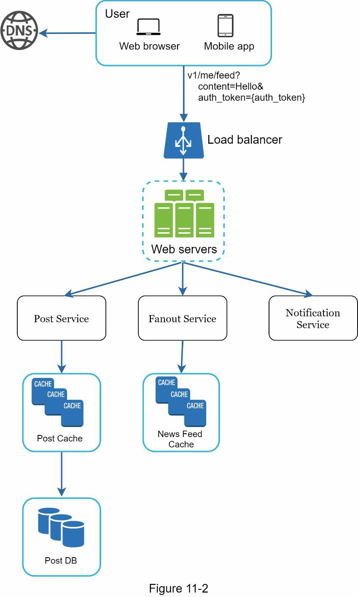
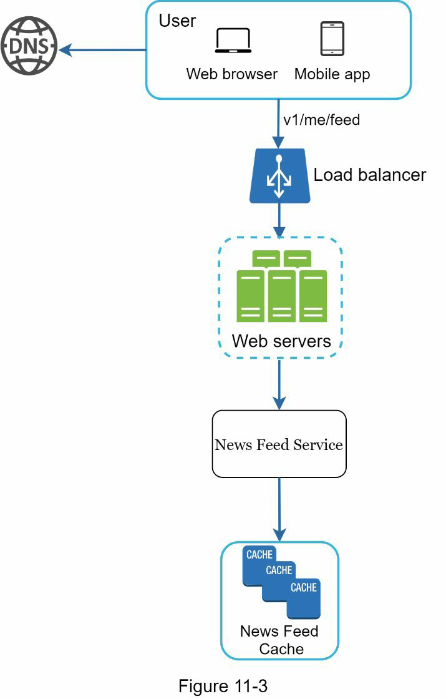
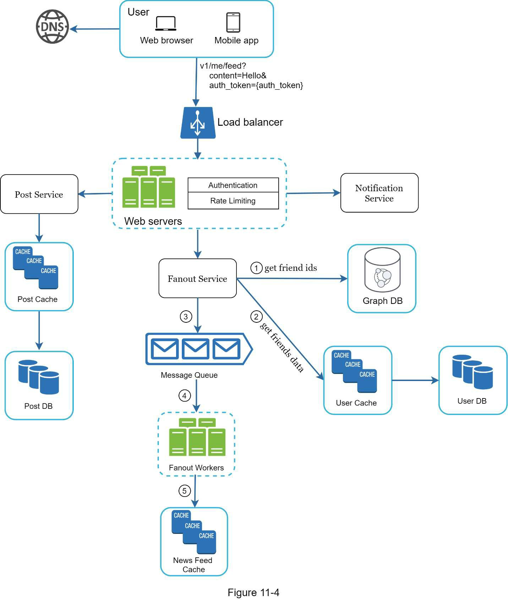
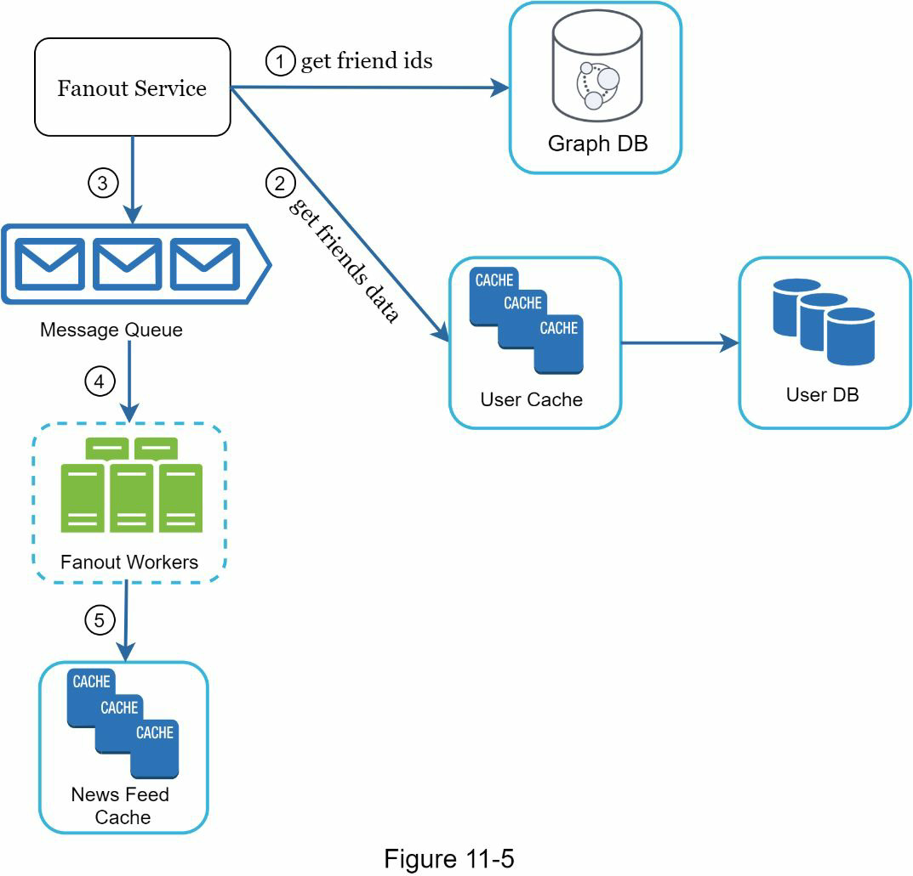
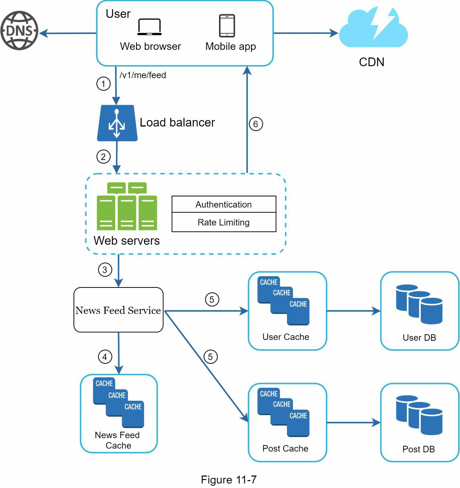
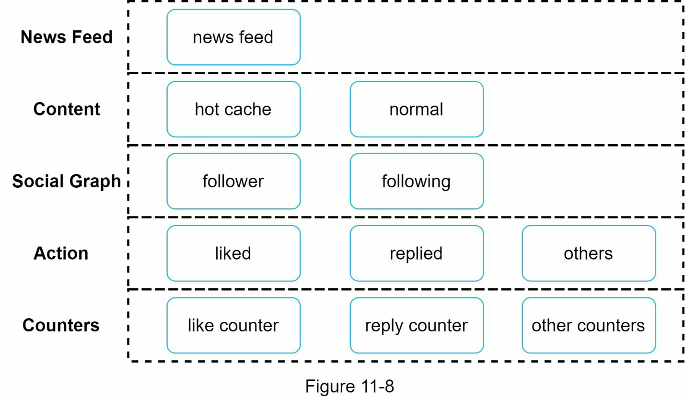

# Chapter 11: 뉴스 피드 시스템 설계

## Step 1 - 문제 이해 및 설계 범위 정의

### 뉴스 피드란?

Facebook 도움말 페이지에 따르면:

> "뉴스 피드는 홈 페이지 중앙에 위치한 실시간 업데이트 목록입니다. 뉴스 피드에는 상태 업데이트, 사진, 동영상, 링크, 앱 활동, 좋아요 등이 포함되며, 이는 사용자가 팔로우한 사람, 페이지, 그룹으로부터 가져옵니다."

이는 기술 인터뷰에서 자주 등장하는 문제입니다. 비슷한 질문으로는 다음과 같은 것들이 있습니다:

- 페이스북 뉴스 피드 설계
- 인스타그램 피드 설계
- 트위터 타임라인 설계

---

## 요구사항 정리

- 플랫폼: **모바일 + 웹**
- 핵심 기능: **게시물 작성 + 친구들의 게시물 피드로 표시**
- 피드 정렬 기준: **최신순**
- 친구 수 제한: **최대 5000명**
- 트래픽 규모: **10M DAU**
- 콘텐츠 유형: **텍스트 + 이미지 + 비디오**

## Step 2 - 상위 수준 설계 제안 및 동의 받기

1. **피드 게시 (Feed Publishing)**
2. **뉴스 피드 생성 (News Feed Building)**

---

### 1. 피드 게시 (Feed Publishing)
사용자가 게시글을 작성하면, 해당 데이터는 **데이터베이스와 캐시**에 저장되고, **친구들의 뉴스 피드에 전파**

#### Feed Publishing API

POST /v1/me/feed
 
**Params:**
- `content`: 게시글의 텍스트 내용
- `auth_token`: 인증 토큰 (API 요청 인증용)

#### 아키텍처 구성도 요약 (게시 흐름)

1. **User**
    - 브라우저 또는 모바일 앱을 통해 `Hello`라는 게시물을 작성함.
    - 예시 요청:  
      `/v1/me/feed?content=Hello&auth_token={auth_token}`

2. **Load Balancer**
    - 웹 서버로 트래픽 분산

3. **Web Servers**
    - 요청을 내부 서비스로 전달

4. **Post Service**
    - 게시글을 **DB와 캐시에 저장**

5. **Fanout Service**
    - 해당 게시물을 **친구들의 피드로 전파**, 캐시에 저장

6. **Notification Service**
    - 친구들에게 새 게시물이 있다는 **푸시 알림 전송**

---

### 2. 뉴스 피드 생성 (News Feed Building)

사용자가 뉴스 피드를 조회하면, 친구들의 게시물을 **최신순(역순)** 으로 집계하여 반환합니다.

#### 🔍 Newsfeed Retrieval API

GET /v1/me/feed

**Params:**
- `auth_token`: 인증 토큰 (API 요청 인증용)

#### 아키텍처 구성도 요약 (피드 생성 흐름)

1. **User**
    - 뉴스 피드를 요청:  
      `/v1/me/feed`

2. **Load Balancer**
    - 웹 서버로 트래픽 분산

3. **Web Servers**
    - 요청을 뉴스 피드 서비스로 라우팅

4. **Newsfeed Service**
    - 캐시에서 피드 데이터(ID 목록)를 가져옴

5. **Newsfeed Cache**
    - 렌더링에 필요한 **피드 ID를 저장**하고 빠르게 반환

## Step 3 - 상세 설계 (Design Deep Dive)

### Feed Publishing 상세 설계

#### Web Server
- **역할**: 클라이언트와 통신, 인증 및 속도 제한 적용
- **기능**
    - 유효한 `auth_token`이 있어야 게시 가능
    - 일정 시간 내 게시 횟수를 제한하여 스팸 및 악용 방지

#### Fanout Service
- **기능**: 게시글을 친구들에게 전파
- **두 가지 모델**
    - **Fanout on Write (Push 모델)**
        - 게시 시 즉시 친구들의 피드에 전파
        - 빠른 조회 가능
        - 단점: 친구 수 많을 경우 성능 저하 (Hotkey 문제), 비활성 사용자에게 낭비
    - **Fanout on Read (Pull 모델)**
        - 피드 조회 시 최신 게시물 가져옴 (요청 시 계산)
        - 비활성 사용자에게 유리, 리소스 절약
        - 단점: 느린 피드 조회 속도

#### **하이브리드 접근법**
- 일반 유저: **Fanout on Write**
- 셀럽/팔로워 많은 유저: **Fanout on Read**
- **Consistent Hashing**을 활용해 hotkey 문제 완화

#### Fanout Service 상세 동작

1. **그래프 DB**에서 친구 ID 조회
2. **User Cache**에서 친구 정보 확인 및 필터링 (뮤트, 제한 공유 등)
3. **메시지 큐**에 친구 목록 + 게시글 ID 전달
4. **Fanout Worker**가 큐에서 데이터 받아 **News Feed Cache**에 저장
    - `<post_id, user_id>` 형태로 저장
    - 전체 객체 대신 ID만 저장 → 메모리 절약
    - 오래된 게시물은 캐시에서 제거하여 메모리 사용 최소화

---

### News Feed Retrieval 상세 설계

#### 클라이언트 뉴스 피드 요청 흐름

1. 클라이언트: `/v1/me/feed` 요청
2. **Load Balancer**가 요청 분산
3. **Web Server**가 **Newsfeed Service** 호출
4. **Newsfeed Cache**에서 post ID 목록 조회
5. **Post Cache / User Cache**에서 ID 기반으로 객체 조회
6. 최종적으로 완성된 피드를 JSON 형태로 클라이언트에 반환

#### 미디어 콘텐츠
- 이미지/동영상 등은 **CDN**에 저장하여 빠르게 제공

---

### Cache Architecture (5단계 계층)

1. **News Feed Cache**
    - 사용자 피드에 보여줄 `post_id` 목록 저장

2. **Content Cache**
    - 각 게시글 데이터 저장
    - 인기 게시물은 **Hot Cache**에 저장

3. **Social Graph Cache**
    - 친구, 팔로워 등 관계 데이터 저장

4. **Action Cache**
    - 좋아요, 댓글 등 유저 액션 상태 저장

5. **Counter Cache**
    - 좋아요 수, 댓글 수, 팔로워 수 등 집계 정보 저장

