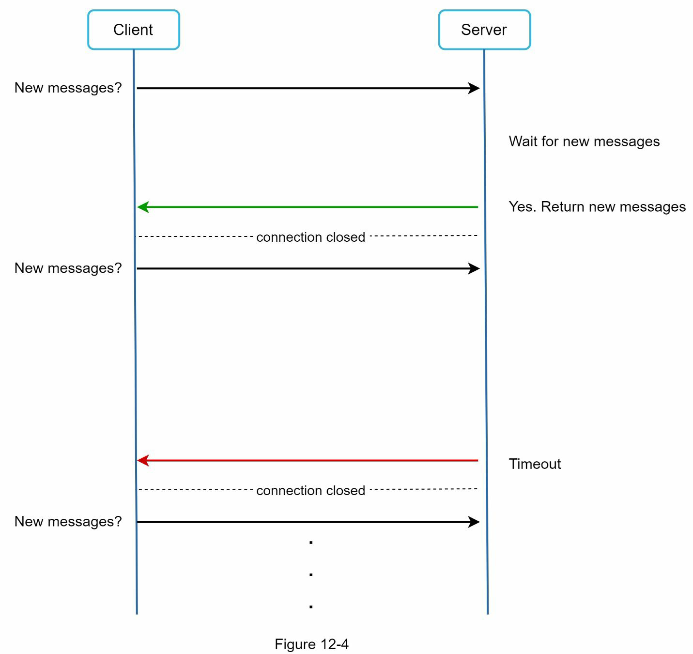
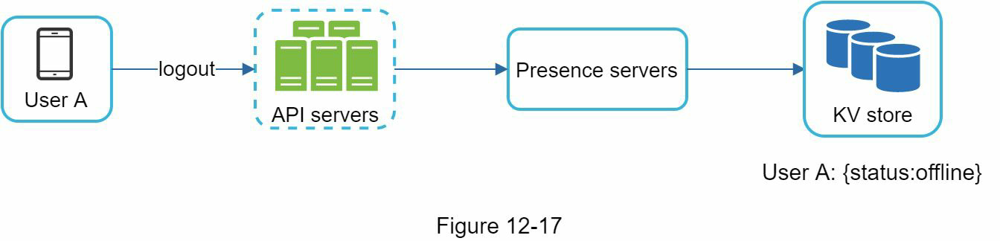

# 📱 CHAPTER 12: CHAT 시스템 설계

이 장에서는 **채팅 시스템 설계**에 대해 다룹니다. 거의 모든 사람이 채팅 앱을 사용하며, 시장에서 가장 인기 있는 앱들 중 일부는 아래와 같습니다.

> **중요**: 어떤 기능을 설계할 것인지 **명확한 요구 사항 정의**가 매우 중요합니다. 예를 들어, 면접관이 1:1 채팅을 원했는데 그룹 채팅 시스템을 설계하면 안 됩니다.

---

## 🧭 Step 1 - 문제 이해 및 설계 범위 정의

먼저, 어떤 종류의 채팅 앱을 설계할 것인지 **합의**가 필요합니다. 시장에는 다양한 유형의 채팅 앱이 존재합니다:

- **1:1 채팅 앱**: Facebook Messenger, WeChat, WhatsApp 등
- **업무용 그룹 채팅 앱**: Slack 등
- **게임 중심 채팅 앱**: Discord (대규모 그룹 및 음성 채팅에 최적화)

---

## ❓ 설계 범위를 정하기 위한 질문 예시

| 질문 | 답변 |
|------|------|
| 어떤 종류의 채팅 앱을 설계하나요? 1:1인가요, 그룹 채팅인가요? | 둘 다 지원해야 합니다. |
| 모바일 앱인가요? 웹 앱인가요? | 둘 다입니다. |
| 이 앱의 예상 규모는 어떻게 되나요? | 5천만 일일 활성 사용자(DAU)를 지원해야 합니다. |
| 그룹 채팅의 최대 인원은 어떻게 되나요? | 최대 100명입니다. |
| 어떤 기능이 중요하나요? 첨부파일도 지원하나요? | 1:1 채팅, 그룹 채팅, 온라인 상태 표시. 텍스트 메시지만 지원합니다. |
| 메시지 길이에 제한이 있나요? | 네, 최대 100,000자 이하로 제한됩니다. |
| 종단 간 암호화(E2EE)가 필요한가요? | 현재는 필요 없지만 나중에 논의할 수 있습니다. |
| 채팅 기록은 얼마나 저장하나요? | **영구 저장**입니다. |

---

## 📌 설계해야 할 핵심 기능

이 장에서는 Facebook Messenger와 유사한 채팅 앱을 설계하며, 다음과 같은 기능에 중점을 둡니다:

- ✅ 1:1 채팅 (낮은 메시지 전달 지연)
- ✅ 소규모 그룹 채팅 (최대 100명)
- ✅ 온라인 상태 표시 (presence)
- ✅ 멀티 디바이스 지원 (동시에 여러 기기 로그인 가능)
- ✅ 푸시 알림 지원

---

## 📈 설계 스케일

- **5천만 DAU (Daily Active Users)** 를 지원하는 대규모 시스템 설계

# Step 2 - 상위 수준 설계 제안 및 동의 얻기

## 클라이언트-서버 통신 개요

채팅 시스템에서 클라이언트는 모바일 또는 웹 애플리케이션이 될 수 있으며, 클라이언트 간 직접 통신은 없고 모두 채팅 서비스에 연결된다.
### 채팅 서비스의 핵심 기능
- 메시지 수신
- 적절한 수신자에게 메시지 전달
- 수신자가 오프라인일 경우 서버에 메시지 보관

## 네트워크 프로토콜 선택

### 전송 측: HTTP
- 클라이언트가 요청을 시작하는 구조
- Keep-Alive를 활용하여 연결 유지
- 초기에는 Facebook Messenger도 HTTP 사용

### 수신 측: 서버가 클라이언트로 전송하는 방식 필요

#### 1. Polling
- 클라이언트가 주기적으로 서버에 메시지 여부를 확인
- 서버 리소스 낭비 가능성 있음

#### 2. Long Polling
- 서버에 연결을 유지하다가 메시지가 오면 응답
- 단점:
    - 송수신자가 같은 서버에 연결되지 않을 수 있음
    - 클라이언트의 연결 해제를 감지하기 어려움
    - 자주 대화하지 않는 사용자에게도 비효율적

#### 3. WebSocket

- 양방향, 지속적인 연결
- HTTP로 연결 후 WebSocket으로 업그레이드
- 포트 80 또는 443 사용으로 방화벽 통과 유리
- 송수신 모두 WebSocket 사용 가능
- 서버 측 효율적인 연결 관리 필요

## 상위 수준 구성 요소

### 주요 컴포넌트
- **Stateless Services**: 로그인, 회원가입, 프로필 등 처리 (HTTP)
- **Stateful Services**: WebSocket 기반 채팅 서버
- **Third-party Integration**: 푸시 알림

### Stateless Services
- 로드 밸런서를 통해 적절한 서비스로 라우팅
- Service Discovery: 연결 가능한 채팅 서버 목록 제공

### Stateful Services
- 클라이언트와 지속 연결 유지
- 한 번 연결된 서버에 계속 유지
- Service Discovery와 협력하여 서버 과부하 방지

### Third-party Integration
- Push Notification: 앱이 꺼져 있어도 메시지 도착 알림

## 확장성 (Scalability)
- 이론적으로 모든 기능을 하나의 서버에 배치 가능
- 예: 1M 동시 사용자 × 10KB 메모리 = 10GB
- BUT: 단일 서버는 단일 장애 지점(SPOF) 문제
- **단일 서버 설계는 시작점일 뿐**임을 명시해야 함

---

# 저장소(Storage) 설계

## 데이터 계층 개요

### 데이터 종류
1. **일반 데이터**: 프로필, 설정, 친구 목록 → 관계형 DB 사용
2. **채팅 기록**: 고유하고 대용량 데이터 → Key-Value Store 사용

### 채팅 데이터 특성
- 데이터 양이 매우 많음 (예: Facebook Messenger + WhatsApp = 600억건/일)
- 대부분 최근 채팅만 조회
- 검색, 멘션 보기 등으로 인한 랜덤 접근 필요
- 읽기:쓰기 = 1:1

### Key-Value Store 선택 이유
- 수평 확장 용이
- 낮은 지연 시간
- 관계형 DB는 인덱스가 커지면 비효율
- Facebook: HBase, Discord: Cassandra 사용

## 데이터 모델

### 1:1 채팅 테이블 구조
| 필드 | 설명 |
|------|------|
| message_id (PK) | 메시지 순서를 위한 고유 ID |
| sender_id | 보낸 사용자 ID |
| receiver_id | 받은 사용자 ID |
| created_at | 생성 시각 |
| content | 메시지 내용 |

> `message_id`는 메시지 순서 보장을 위해 사용 (created_at은 동시에 생성된 메시지를 구분 못할 수 있음)

### 그룹 채팅 테이블 구조
| 필드 | 설명 |
|------|------|
| channel_id (PK Part) | 그룹 채팅 ID |
| message_id (PK Part) | 메시지 고유 ID |
| sender_id | 보낸 사용자 ID |
| created_at | 생성 시각 |
| content | 메시지 내용 |

> `channel_id`는 파티션 키, 모든 쿼리는 채널 단위로 수행됨

## 메시지 ID 생성 전략

### 요구사항
- 고유한 ID
- 시간순 정렬 가능해야 함

### 접근 방법
1. **MySQL auto_increment**  
   → NoSQL에서는 일반적으로 미지원

2. **전역 64비트 ID 생성기 (예: Snowflake)**  
   → Chapter 7 참고

3. **로컬 시퀀스 생성기**  
   → 그룹/채널 내에서만 고유하면 되므로 구현이 쉬움

# Step 3 - Design Deep Dive

시스템 디자인 인터뷰에서는 고수준 설계를 기반으로 일부 컴포넌트를 깊이 있게 탐구해야 한다. 채팅 시스템의 경우 **서비스 디스커버리**, **메시지 흐름**, **온라인/오프라인 표시**가 그 대상이다.

---

## 📍 Service Discovery
**역할**: 클라이언트에게 최적의 채팅 서버를 추천  
**기준**: 지리적 위치, 서버 용량 등  
**도구**: Apache Zookeeper – 사용 가능한 모든 채팅 서버를 등록하고, 최적의 서버를 클라이언트에 추천

### 동작 흐름 (그림 12-11 기준)

1. 사용자 A가 앱에 로그인 시도
2. 로드 밸런서가 로그인 요청을 API 서버에 전달
3. 인증 후, 서비스 디스커버리 시스템이 최적의 채팅 서버(예: 서버 2)를 선택하여 클라이언트에게 전달
4. 사용자 A는 WebSocket으로 서버 2에 연결

---

## 💬 Message Flows

### 1:1 채팅 흐름 (그림 12-12 기준)

1. 사용자 A → 채팅 서버 1로 메시지 전송
2. 서버 1이 ID 생성기로부터 message_id 발급
3. 메시지를 message sync queue에 전송
4. 메시지를 Key-Value Store에 저장
5. 사용자 B 상태에 따라 분기:
    - **온라인**: 메시지를 채팅 서버 2 (사용자 B가 연결된 서버)로 전달
    - **오프라인**: Push Notification 서버에서 푸시 알림 전송
6. 채팅 서버 2 → 사용자 B에게 WebSocket을 통해 메시지 전송

---

### 📱 다중 디바이스 동기화 (그림 12-13)

- 사용자 A가 **핸드폰**, **노트북**에서 로그인하면 두 디바이스 모두 WebSocket으로 서버 1과 연결됨
- 각 디바이스는 `cur_max_message_id` 값을 유지하며, 이는 해당 디바이스가 받은 마지막 메시지 ID임

#### 새로운 메시지 조건:
- 수신자 ID == 현재 사용자 ID
- 메시지 ID > cur_max_message_id

> 이를 통해 각 디바이스는 KV 저장소에서 자신에게 필요한 새로운 메시지만 가져오면 된다.

---

### 👥 소규모 그룹 채팅 흐름 (그림 12-14, 12-15)

**가정**: 그룹 멤버 = A, B, C

1. 사용자 A가 메시지 전송
2. 메시지가 각 수신자의 메시지 동기화 큐에 복사됨:
    - User B의 큐
    - User C의 큐

> 이 방식은 각 수신자가 자신의 inbox(동기화 큐)만 확인하면 되므로 **메시지 동기화가 단순해짐**

#### 장점:
- 클라이언트가 자신의 큐만 확인하면 됨
- 소규모 그룹(예: WeChat 최대 500명)에서 효율적

#### 한계:
- 그룹 규모가 커질수록 각 수신자에게 복사본 저장은 비효율적

---

## ✅ Online Presence

### 역할: 사용자의 온라인/오프라인 상태 관리 및 표시
**컴포넌트**: Presence Servers (WebSocket을 통해 클라이언트와 통신)

---

### 1. 로그인 시 (그림 12-16)

- WebSocket 연결 성립 후:
    - 사용자 A의 온라인 상태를 **KV 저장소에 저장**
    - `last_active_at` 타임스탬프 함께 저장
    - Presence Indicator에 **온라인** 표시됨

---

### 2. 로그아웃 시 (그림 12-17)
- 상태를 **오프라인**으로 변경
- Presence Indicator에 **오프라인** 표시

---

### 3. 비정상 연결 종료 (인터넷 끊김 등)
- 인터넷 연결이 불안정할 경우 처리 필요
- 단순히 연결 끊김마다 오프라인 표시 → **사용자 경험 저하**

#### 💡 해결책: Heartbeat 방식
- 일정 간격으로 클라이언트가 Presence Server에 heartbeat 전송 (예: 5초 간격)
- Presence Server가 x초 이내에 heartbeat 수신 실패 시 → **오프라인으로 간주**

예:
- 5초마다 heartbeat 전송
- 3회 후 끊김, 30초 이상 재접속 없으면 → 오프라인 상태로 변경 (그림 12-18)

---

## 📡 Online Status Fanout (그림 12-19)

### 어떻게 친구들이 A의 상태 변화를 알 수 있을까?

- **Publish-Subscribe 모델 사용**
- 각 친구 쌍은 **채널 유지** (예: A-B, A-C, A-D)
- 사용자 A의 상태 변경 시:
    - A는 각 채널에 상태 변경 이벤트 publish
    - B, C, D는 해당 채널을 subscribe 하고 있으므로 상태 알림을 수신

> WebSocket을 통해 실시간 반영됨

#### 스케일 문제
- 예: 10만 명 그룹에서 A의 상태 변경 → **10만 이벤트 발생**
- 해결 방법:
    - 대규모 그룹에서는 상태 변경 시 전체에게 알리지 않음
    - **입장 시** 또는 **친구 목록 수동 새로고침 시** 상태 조회

---

## ✅ 요약

| 항목 | 주요 내용 |
|------|----------|
| Service Discovery | Zookeeper로 최적의 채팅 서버 선택 |
| 1:1 메시지 흐름 | ID 생성 → 메시지 저장 → 실시간/푸시 전달 |
| 메시지 동기화 | `cur_max_message_id` 기반으로 각 디바이스가 새로운 메시지 가져옴 |
| 그룹 채팅 | 수신자 수만큼 메시지 복사 → inbox 구조 |
| Presence | WebSocket + Heartbeat로 실시간 상태 관리 |
| Status Fanout | Publish/Subscribe 모델 → 소규모 그룹에서 실시간 반영, 대규모는 요청 시 조회 |
