# Chapter 14: 유튜브 설계

> YouTube는 겉보기에는 단순해 보이지만, 실제로는 방대한 규모와 복잡한 기술로 운영된다.
## 주요 특징
- 크리에이터가 영상을 업로드하고, 사용자가 재생하는 구조
- 단순한 UI 뒤에 복잡한 시스템과 인프라가 존재

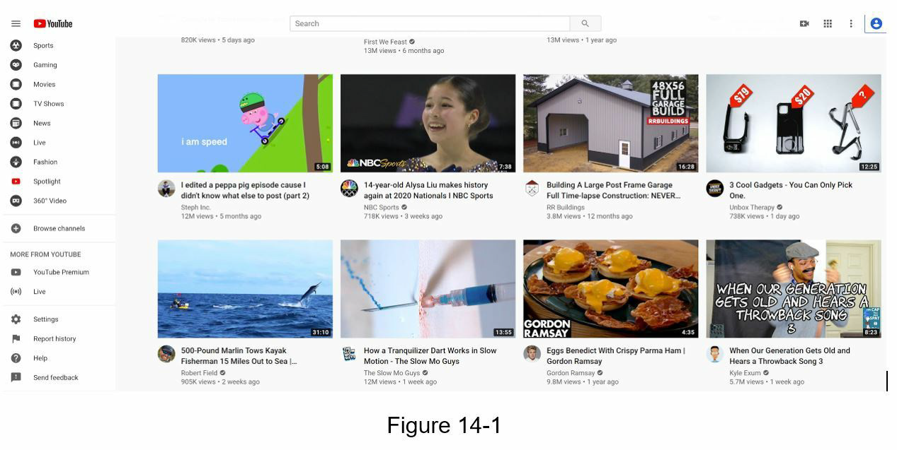

## 2020년 YouTube 통계
- **월간 활성 사용자 수**: 20억 명
- **일일 시청 비디오 수**: 50억 개
- **미국 성인 73%**가 YouTube 사용
- **YouTube 크리에이터 수**: 5천만 명
- **2019년 광고 수익**: 151억 달러 (전년 대비 36% 증가)
- **모바일 인터넷 트래픽 점유율**: 37%
- **지원 언어 수**: 80개

# Step 1 - 문제 이해 및 설계 범위 확정

## 기능 스코프 축소를 위한 질의응답
- **중점 기능**: 비디오 업로드 및 비디오 시청
- **지원 클라이언트**: 모바일 앱, 웹 브라우저, 스마트 TV
- **일일 활성 사용자 (DAU)**: 500만 명
- **1인당 평균 사용 시간**: 하루 30분
- **국제 사용자 지원 여부**: 지원
- **비디오 해상도 및 포맷**: 대부분 지원
- **암호화 필요 여부**: 필요
- **비디오 파일 크기 제한**: 최대 1GB
- **클라우드 인프라 활용 가능 여부**: 가능 (Amazon, Google, Microsoft 등)

## 설계 범위 (Scope)
- 빠른 비디오 업로드
- 부드러운 비디오 스트리밍
- 비디오 화질 변경 기능 지원
- 낮은 인프라 비용
- 높은 가용성(High Availability), 확장성(Scalability), 신뢰성(Reliability)
- 지원 클라이언트: 모바일 앱, 웹 브라우저, 스마트 TV

---

## 기본 가정
- 일일 활성 사용자 (DAU): 500만 명
- 사용자당 하루 평균 시청 비디오 수: 5개
- 10% 사용자가 하루에 1개 비디오 업로드
- 평균 비디오 크기: 300MB

## 스토리지 요구사항
- 일일 업로드 총량 = 500만 × 10% × 300MB = **150TB/day**

## CDN 비용 추정
- **CDN 요금**: 전송된 데이터 기준 요금 부과
- Amazon CloudFront 기준, 미국 내 평균 비용: **$0.02/GB**
- 일일 스트리밍 데이터 양 = 500만 × 5 × 0.3GB = 750만 GB
- 일일 CDN 비용 = 750만 GB × $0.02 = **$150,000/day**

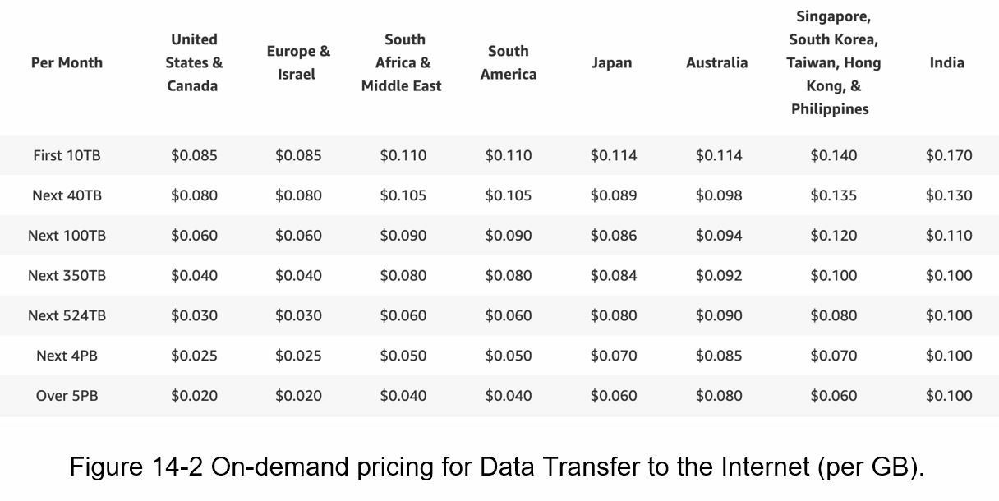

# Step 2 - 개략적 설계안 제시 및 동의 구하기

## 클라우드 서비스 활용
- 모든 것을 직접 구축하는 것은 현실적이지 않음.
- **CDN**과 **Blob Storage** 같은 클라우드 서비스를 적극 활용.
- 이유:
    - 시스템 디자인 면접은 기술 자체를 세세히 구현하는 것이 목표가 아님.
    - Blob storage나 CDN을 직접 구축하는 것은 매우 복잡하고 비용이 큼.
    - Netflix, Facebook도 일부 인프라는 클라우드 서비스에 의존.

---

# 고급 시스템 구성 요소
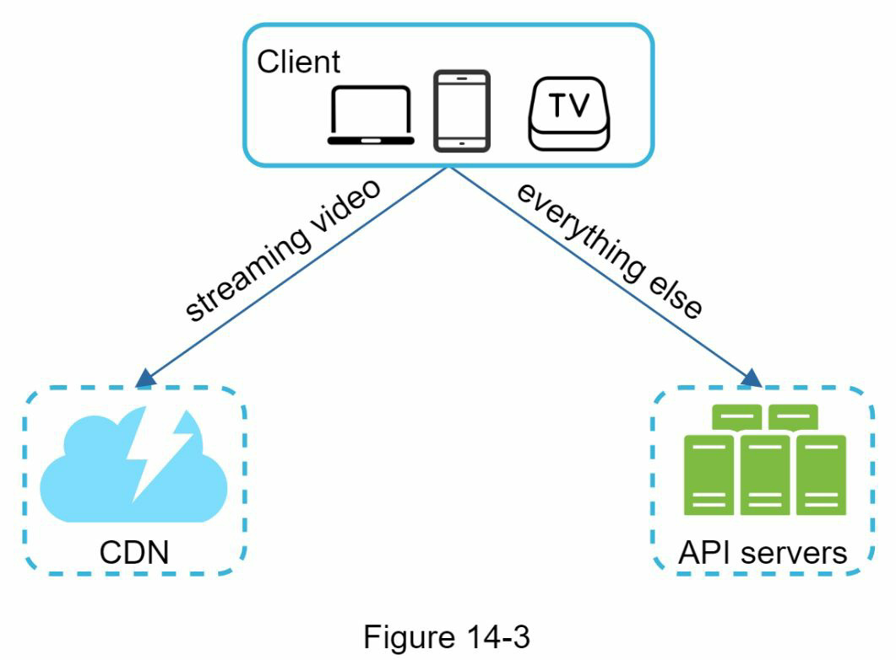
- **Client**: 컴퓨터, 모바일, 스마트 TV 등
- **CDN**: 비디오를 저장하고 스트리밍 제공
- **API Servers**: 비디오 스트리밍 외 모든 요청 처리
    - 피드 추천
    - 비디오 업로드 URL 생성
    - 메타데이터 업데이트
    - 회원가입 등

---

# 관심 흐름 (Flows)

## 1. 비디오 업로드 플로우
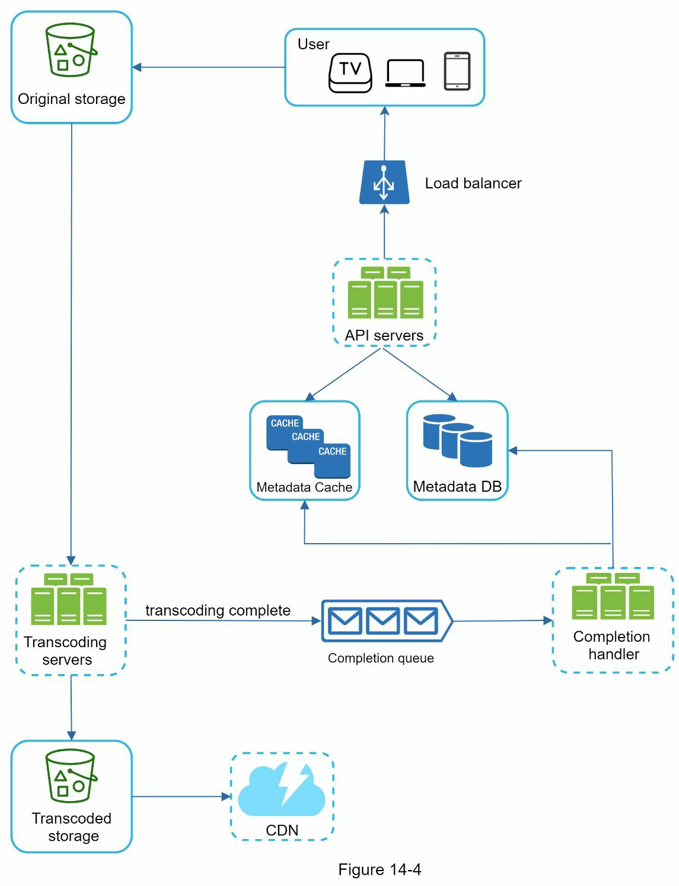
### 주요 컴포넌트
- **사용자**: 다양한 디바이스에서 YouTube 사용
- **로드 밸런서**: API 서버로 요청 분산
- **API 서버**: 모든 요청 처리 (스트리밍 제외)
- **메타데이터 DB**: 비디오 메타데이터 저장 (샤딩 및 복제 적용)
- **메타데이터 캐시**: 메타데이터 및 사용자 정보 캐싱
- **원본 저장소**: 원본 비디오를 저장하는 Blob Storage
- **트랜스코딩 서버**: 비디오 포맷 변환 (트랜스코딩)
- **트랜스코딩 비디오 저장소**: 변환된 비디오 파일 저장
- **CDN**: 변환된 비디오를 캐시하여 스트리밍 제공
- **트랜스코딩 완료 큐**: 트랜스코딩 완료 이벤트를 저장하는 메시지 큐
- **트랜스코딩 완료 핸들러**: 큐에서 이벤트를 가져와 메타데이터 DB와 캐시 업데이트

---

## 2. 비디오 업로드 플로우 세부

### Flow A - 실제 비디오 업로드

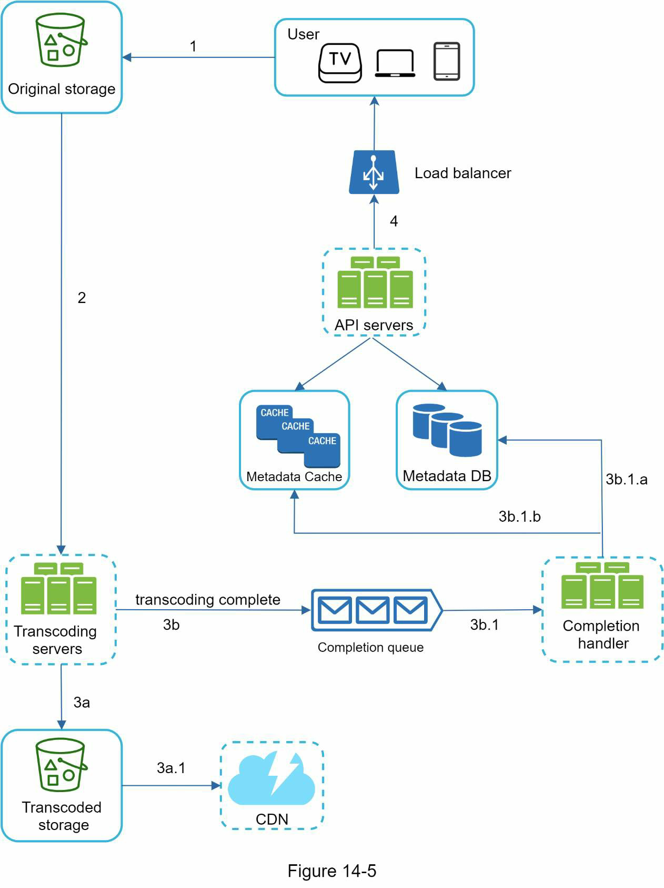

1. 클라이언트가 비디오를 원본 저장소에 업로드.
2. 트랜스코딩 서버가 원본 비디오를 가져와 변환 시작.
3. 변환 완료 후:
    - 변환된 비디오를 트랜스코딩 비디오 저장소에 저장하고 CDN으로 배포.
    - 트랜스코딩 완료 이벤트를 트랜스코딩 완료 큐에 저장.
4. 트랜스코딩 완료 핸들러가 이벤트를 처리하여 메타데이터 DB와 캐시를 업데이트.
5. API 서버가 클라이언트에 업로드 완료 알림.
   

### Flow B - 메타데이터 업데이트
- 비디오 파일 업로드와 병렬로, 클라이언트는 메타데이터 업데이트 요청을 전송.
- API 서버가 메타데이터 DB와 캐시를 업데이트.

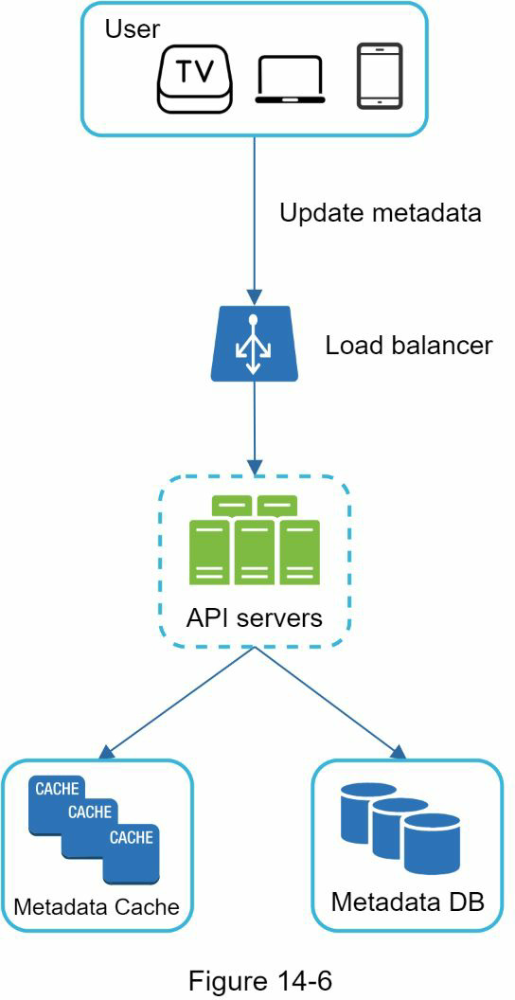

---

# 3. 비디오 스트리밍 플로우

## 스트리밍 개요
- 전체 비디오를 다운로드하지 않고, 필요한 데이터만 조금씩 받아서 즉시 재생.
- **Streaming Protocols**:
    - MPEG-DASH
    - Apple HLS
    - Microsoft Smooth Streaming
    - Adobe HDS
- 스트리밍 프로토콜은 디바이스 및 네트워크 상태에 따라 최적화된 스트림을 제공.

## 스트리밍 흐름
- 사용자가 비디오를 재생하면 가장 가까운 CDN 엣지 서버에서 비디오를 스트리밍.
- 최소한의 지연(latency)으로 연속적인 비디오 재생 가능.
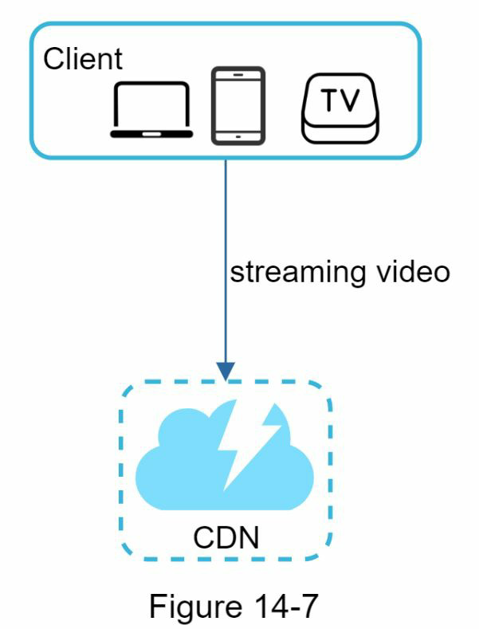

# Step 3 - 상세 설계

## 비디오 업로드 흐름과 스트리밍 흐름

시스템을 비디오 업로드 플로우와 스트리밍 플로우로 나눈 뒤, 각 플로우를 최적화하고 오류 처리 메커니즘을 소개한다.

## 비디오 트랜스코딩

### 트랜스코딩이 필요한 이유

- 원본 비디오는 저장공간을 많이 차지한다.
- 다양한 디바이스와 브라우저에서 재생하려면 여러 포맷 지원이 필요하다.
- 네트워크 속도에 따라 고화질/저화질 자동 조정이 필요하다.
- 모바일 환경에서는 네트워크 품질 변동에 대비해야 한다.

### 비디오 포맷 구성

- **컨테이너**: 비디오, 오디오, 메타데이터를 담는 파일 (예: .avi, .mov, .mp4)
- **코덱**: 압축 및 복원 알고리즘 (예: H.264, VP9, HEVC)

## DAG (Directed Acyclic Graph) 모델

트랜스코딩 작업을 유연하고 병렬적으로 처리하기 위해 DAG(유향 비순환 그래프) 모델을 사용한다.

### 예시 흐름
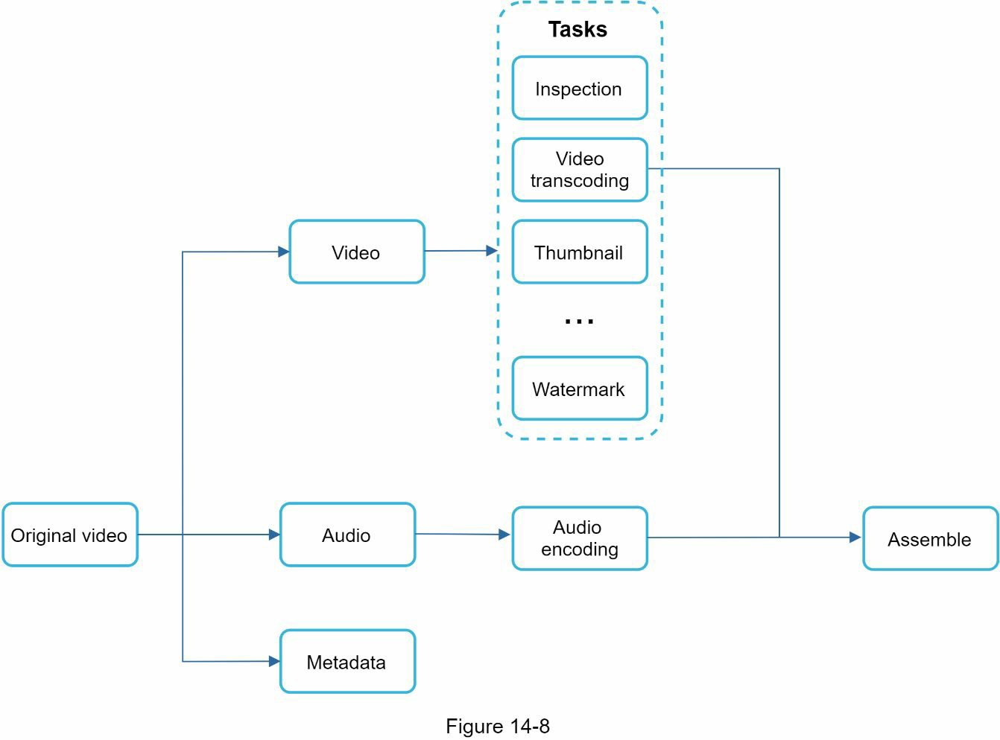
- 원본 비디오 → 비디오, 오디오, 메타데이터로 분리
- 이후:
    - 인스펙션(품질 검사)
    - 다양한 해상도/코덱으로 인코딩
    - 썸네일 생성
    - 워터마크 삽입

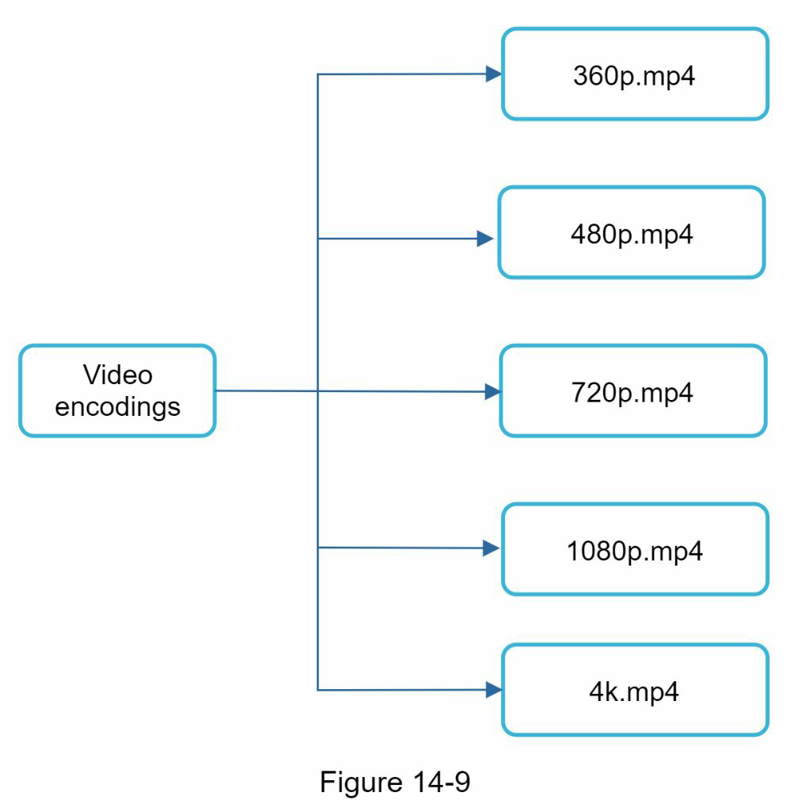
## 비디오 트랜스코딩 아키텍처
### 구성 요소
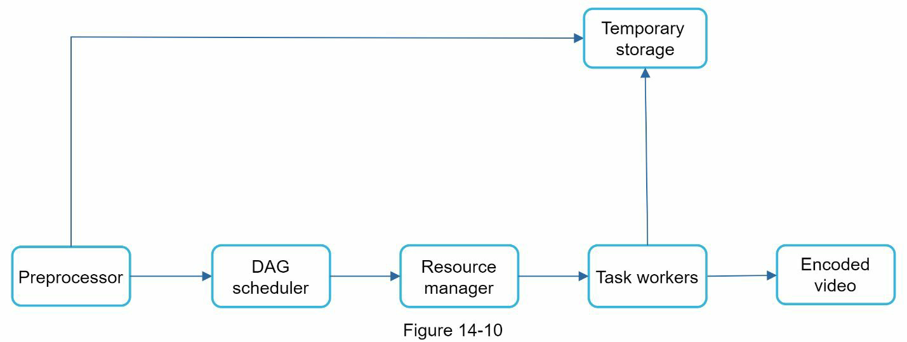

1. 전처리기
2. DAG 스케쥴러
3. 자원 관리자
4. 작업 실행 서버
5. 임시 저장소
6. 인코딩된 비디오

### 각 컴포넌트 역할

- **전처리기**: 비디오를 GOP 단위(보통 몇 초)로 분할하고 DAG 생성, 데이터 캐싱
- **DAG 스케쥴러**: DAG를 스테이지별로 분리하여 태스크 큐에 등록
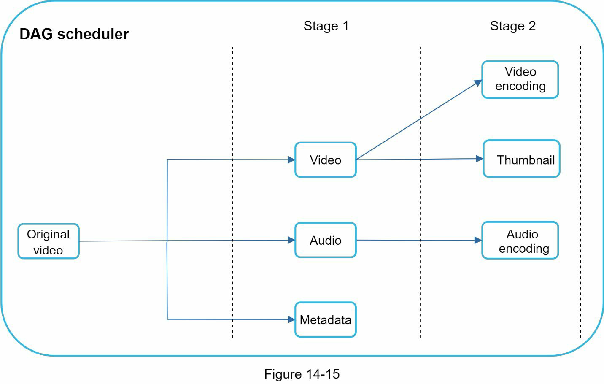
- **자원 관리자**: 큐 관리 및 워커에 작업 할당
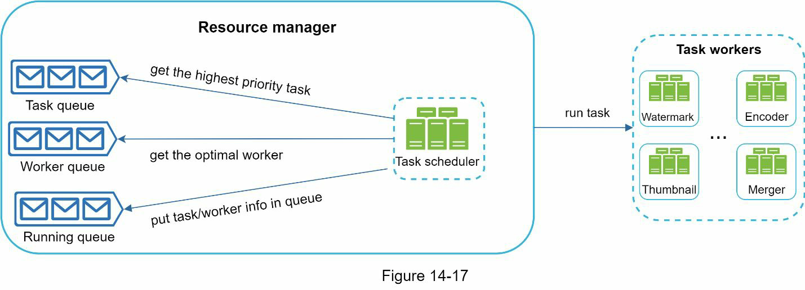
- **작업 실행 서버**: 개별 작업 실행
- **임시 저장소**: 메타데이터는 인메모리 캐시, 파일은 Blob 스토리지
- **인코딩된 비디오**: 최종 인코딩 결과 저장

## 시스템 최적화

### 업로드 속도 최적화

- GOP 단위 업로드로 빠른 재전송 지원

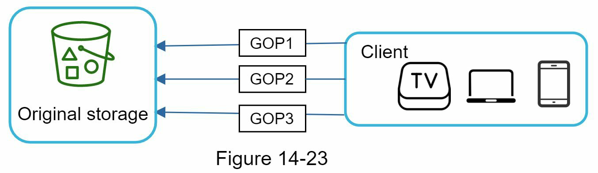

- 전 세계 업로드 센터 배치

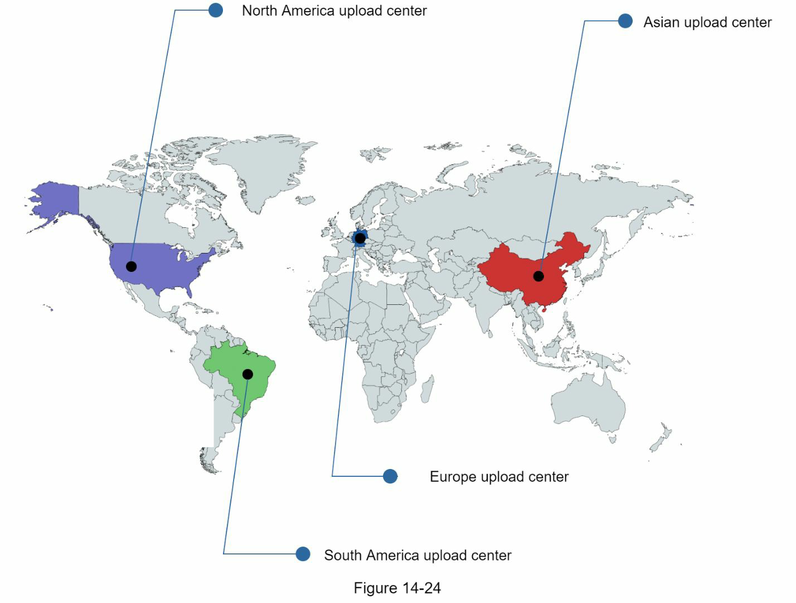

### 병렬성 향상

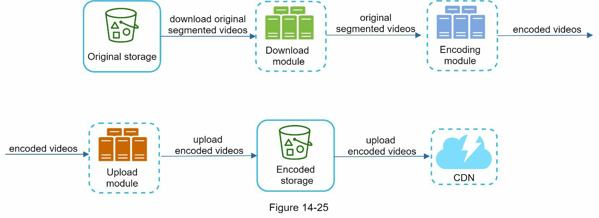

- 느슨한 결합 + Message Queue 도입
- 모듈별 독립 실행 가능

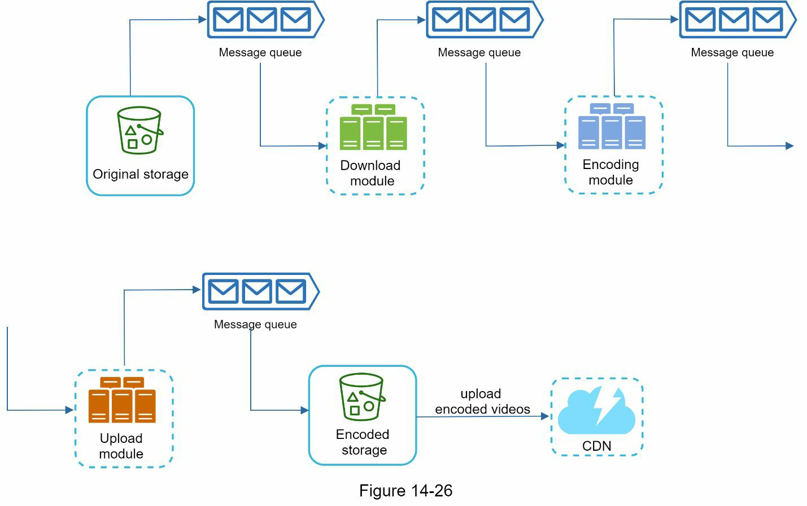

### 안전성 강화

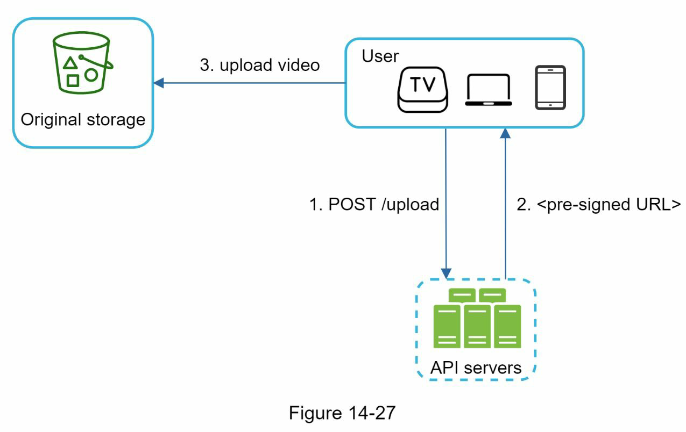

- Pre-signed URL을 이용한 업로드
- DRM, AES 암호화, 워터마크 적용

### 비용 절감
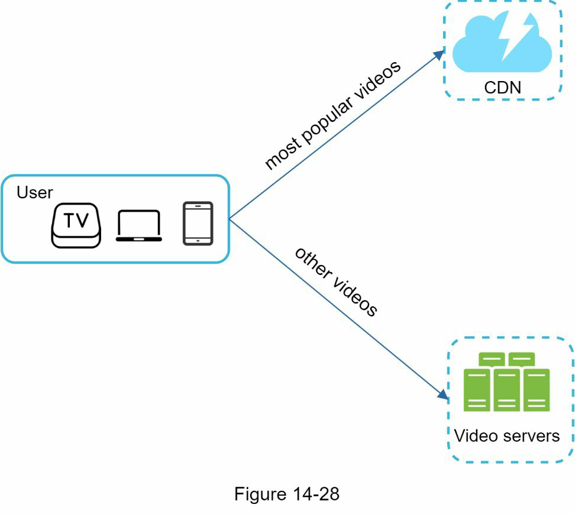
- 인기 있는 영상만 CDN에 배포
- 인기 없는 영상은 고용량 서버 제공
- 짧은 영상은 On-Demand Encoding
- 지역별 분산 저장
- 대규모 서비스는 자체 CDN 구축 고려

## 오류 처리 전략

### 복구 가능한 오류

- 재시도 후 성공 시 진행
- 실패 시 오류 코드 반환

### 복구 불가능한 오류

- 비디오 포맷 오류 등은 작업 중단 및 오류 코드 반환

### 컴포넌트별 오류 대응

- 업로드 오류: 재시도
- 비디오 분할 오류: 서버가 처리
- 트랜스코딩 오류: 재시도
- Preprocessor 오류: DAG 재생성
- DAG Scheduler 오류: 작업 재스케줄링
- Resource Manager 장애: Replica 사용
- Worker 장애: 다른 Worker로 작업 이관
- API 서버 장애: 다른 서버로 요청 포워딩
- 메타데이터 캐시 장애: 복제본에서 읽기
- 메타데이터 DB 장애:
    - Master 다운 시 Slave 승격
    - Slave 다운 시 다른 Slave 사용 및 복구
