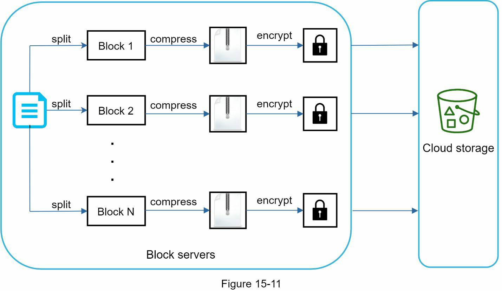

# CHAPTER 15: 구글드라이브 설계

## Google Drive 이해하기

Google Drive는 다음과 같은 특징을 가진 **파일 저장 및 동기화 서비스**

- 문서, 사진, 비디오 및 기타 파일을 **클라우드에 저장**
- **컴퓨터, 스마트폰, 태블릿** 등 다양한 기기에서 파일에 접근
- 저장된 파일을 **친구, 가족, 동료와 쉽게 공유**

# 1단계 - 문제 이해 및 설계 범위 확정

## 이번 장에서 다루는 기능

- 파일 추가 (Drag & Drop 지원)
- 파일 다운로드
- 여러 기기 간 파일 동기화
- 파일 수정 이력 확인
- 파일 공유 (친구, 가족, 동료와)
- 파일이 편집, 삭제, 공유될 때 알림 전송

---

## 이번 장에서 다루지 않는 기능

- **Google 문서 편집 및 협업 기능**  
  ➔ 다수 인원이 동시에 문서 편집하는 기능은 설계 범위에서 제외

---

## 비기능 요구사항

- **Reliability (신뢰성)**: 데이터 손실은 절대 허용되지 않는다.
- **Fast Sync Speed (빠른 동기화 속도)**: 느린 동기화는 사용자 이탈을 유발할 수 있다.
- **Bandwidth Usage (대역폭 사용 최적화)**: 불필요한 네트워크 소모는 피해야 한다 (특히 모바일 환경).
- **Scalability (확장성)**: 대규모 트래픽을 처리할 수 있어야 한다.
- **High Availability (고가용성)**: 일부 서버에 문제가 생겨도 시스템은 계속 사용 가능해야 한다.

---

## 개략적 추정치

- 가입자 수: 5천만 명
- DAU: 1천만 명
- 무료 제공 스토리지: 10GB/사용자
- **총 스토리지**: 50M × 10GB = **500 페타바이트**
- 업로드 빈도: 사용자당 하루 2개 파일
- 평균 파일 크기: 500KB
- 읽기/쓰기 비율: 1:1
- **업로드 API QPS**:  
  → 10M × 2 / (24시간 × 3600초) ≈ **240 QPS**
- **피크 QPS**:  
  → 240 × 2 = **480 QPS**

# 2단계 - 개략적 설계안 제시 및 동의 구하기

### 단일 서버 설정

#### 구성 요소:
- **웹 서버**: 파일 업로드 및 다운로드 요청을 처
- **데이터베이스**: 메타데이터(사용자 데이터, 로그인 정보, 파일 정보 등)를 저장
- **저장 시스템**: 업로드된 파일을 저장합니다. 1TB의 저장 공간을 할당

#### 파일 저장 구조
- `/drive/` 디렉토리 하위에 **네임스페이스**라는 디렉토리들이 있으며, 각 네임스페이스는 해당 사용자가 업로드한 파일들을 포함
- 파일 이름은 원본 이름을 그대로 유지하며, 파일은 네임스페이스와 상대 경로를 결합한 유니크한 식별자로 관리

---

### API

#### 1. Google Drive에 파일 업로드
- **업로드 유형**:
  - **간단 업로드**: 작은 파일에 사용
  - **재개 가능한 업로드**: 큰 파일이나 네트워크 장애가 있을 가능성이 있는 파일에 사용
- **재개 가능한 업로드 예시**:
  - https://api.example.com/files/upload?uploadType=resumable 
  - 파라미터: 
    - uploadType=resumable
    - data: 업로드할 로컬 파일
  1. 재개 가능한 URL을 요청
  2. 데이터를 업로드하고 상태를 모니터링 
  3. 업로드가 중단되면 업로드를 재개

#### 2. Google Drive에서 파일 다운로드
- **다운로드 파일 API**:
  - https://api.example.com/files/download
  - 파라미터: 
    - path: /path/to/file 
    - 예시: { "path": "/recipes/soup/best_soup.txt" }

#### 3. 파일 수정 내역 조회
- **수정 내역 API**:
  - https://api.example.com/files/list_revisions
  - 파라미터:
    - path: 파일 경로 (수정 내역을 조회할 파일)
    - limit: 반환할 수정 내역 최대 개수
    - 예시: { "path": "/recipes/soup/best_soup.txt", "limit": 20 }

- **보안**: 모든 API는 사용자 인증이 필요하며, HTTPS로 데이터를 암호화하여 전송

---

### 단일 서버에서 벗어나기

파일 업로드가 증가하면 **저장 공간**이 부족해짐. (예: 10MB 남음). 이를 해결하기 위해 **데이터 샤딩**을 도입하여 데이터를 여러 저장 서버에 분배. 샤딩은 `user_id`를 기준으로 이루어짐

1. **샤딩**: `user_id` 기준으로 데이터를 분할 저장
2. **Amazon S3 스토리지**:
- **Amazon S3**를 사용하여 파일을 저장하기로 결정
- **같은 지역** 및 **다른 지역 복제**를 지원하여 데이터의 내구성과 가용성을 보장
- **S3 버킷**은 파일 시스템에서의 폴더처럼 동작

---

### 추가 개선 사항

- **로드 밸런서**: 네트워크 트래픽을 고르게 분배하며, 웹 서버가 다운되면 트래픽을 재분배
- **웹 서버**: 로드 밸런서를 추가한 후, 트래픽에 맞춰 웹 서버를 쉽게 추가하거나 제거
- **메타데이터 데이터베이스**: 단일 실패 지점을 방지하기 위해 메타데이터 데이터베이스를 서버 외부로 이동시키고, 데이터 복제 및 샤딩을 통해 확장성 및 가용성 확보
- **파일 저장**: 파일은 Amazon S3에 저장되며, **두 지역에 복제**하여 가용성 및 내구성을 보장

이러한 개선을 통해 웹 서버, 메타데이터 데이터베이스 및 파일 저장을 단일 서버에서 분리

---

### 동기화 충돌 처리

구글 드라이브와 같은 대규모 시스템에서는 **동기화 충돌**이 발생할 수 있습니다. 여러 사용자가 동시에 동일한 파일을 수정하면 충돌이 발생합니다. 이를 해결하는 전략은 다음과 같습니다:

- **충돌 해결**: 첫 번째로 처리된 버전이 우선하며, 이후 버전은 충돌을 겪습니다.
- **충돌 예시**:
- 사용자 1의 업데이트가 먼저 처리됩니다.
- 사용자 2는 충돌을 겪고, 로컬 버전과 서버에서 최신 버전을 모두 표시합니다.
- 사용자 2는 두 파일을 **병합**하거나 하나를 **덮어쓸** 수 있습니다.

---

### 고수준 설계 다이어그램

- **사용자**: 브라우저나 모바일 앱 사용
- **블록 서버**: 파일을 블록 단위로 업로드하여 클라우드 스토리지에 저장. (최대 4MB 블록, Dropbox에서 차용)
- **클라우드 스토리지 (S3)**: 파일 블록을 저장
- **콜드 스토리지**: 비활성 데이터를 저장
- **로드 밸런서**: API 서버 간에 요청을 고르게 분배
- **API 서버**: 사용자 인증, 메타데이터 관리, 파일 업데이트 등을 처리
- **메타데이터 데이터베이스**: 사용자, 파일, 블록, 버전 등 메타데이터를 저장
- **메타데이터 캐시**: 빠른 조회를 위해 일부 메타데이터를 캐싱
- **알림 서비스**: 파일 추가/수정/삭제 등의 이벤트가 발생할 때 관련 클라이언트에 알림
- **오프라인 백업 큐**: 클라이언트가 오프라인 상태일 때 변경 사항을 저장하고, 온라인 상태일 때 동기화

# 3단계 - 세부 설계 분석

블록 서버, 메타데이터 데이터베이스, 업로드 흐름, 다운로드 흐름, 알림 서비스, 저장 공간 절약 및 장애 처리.

---

### 블록 서버

대용량 파일은 자주 업데이트되면 매번 파일 전체를 전송하는 데 많은 대역폭을 소비. 네트워크 트래픽을 최소화하기 위한 두 가지 최적화 방법:
- **델타 동기화 (Delta Sync)**: 파일이 수정되면 전체 파일을 전송하는 대신 수정된 블록만 동기화
- **압축 (Compression)**: 각 블록에 압축 알고리즘을 적용하여 데이터 크기를 줄임. 예를 들어, 텍스트 파일에는 `gzip`이나 `bzip2`와 같은 알고리즘을 사용하고, 이미지나 비디오에는 다른 압축 알고리즘을 사용

**블록 서버 작동 방식**:
1. 파일을 작은 블록으로 분할
2. 각 블록을 압축
3. 보안을 위해 각 블록을 암호화한 후 클라우드 스토리지에 업로드
4. **델타 동기화**: 수정된 블록만 클라우드 스토리지에 업로드

블록 서버는 델타 동기화와 압축을 통해 네트워크 트래픽을 절약

---

### 높은 일관성 요구사항

우리 시스템은 기본적으로 **강력한 일관성**을 요구. 파일이 서로 다른 클라이언트에서 다르게 표시되는 것은 허용되지 않음. 따라서 메타데이터 캐시와 데이터베이스 계층에서 강력한 일관성을 제공

메모리 캐시는 기본적으로 **최종 일관성(Eventual Consistency)** 모델을 채택하는데, 이는 복제본 간에 데이터가 일치하지 않을 수 있음. 강력한 일관성을 달성하기 위해 다음을 보장해야 함:
- 캐시 복제본과 마스터 데이터가 일치
- 데이터베이스에 쓰기가 발생하면 캐시를 무효화하여 캐시와 데이터베이스가 동일한 값을 유지

관계형 데이터베이스에서는 ACID(원자성, 일관성, 고립성, 내구성) 속성이 기본적으로 지원되므로 강력한 일관성을 유지하기 쉬움. 반면, NoSQL 데이터베이스는 ACID 속성을 기본적으로 지원하지 않기 때문에 동기화 논리에 ACID 속성을 프로그램적으로 통합해야 함.

우리 설계에서는 ACID 속성을 기본으로 제공하는 관계형 데이터베이스를 선택

---

### 메타데이터 데이터베이스

**메타데이터 데이터베이스**는 파일과 관련된 다양한 정보를 저장하는 역할. 기본적인 테이블 구조는 다음과 같음:

- **User**: 사용자 정보를 저장(예: 사용자 이름, 이메일, 프로필 사진 등).
- **Device**: 사용자 디바이스 정보를 저장. `push_id`는 모바일 푸시 알림을 보내는 데 사용. 하나의 사용자에게 여러 디바이스가 있을 수 있음.
- **Namespace**: 사용자의 루트 디렉토리
- **File**: 최신 파일과 관련된 정보를 저장
- **File_version**: 파일의 버전 히스토리 저장. 기존 행은 읽기 전용으로 유지하여 파일 버전의 무결성을 보장.
- **Block**: 파일 블록에 관련된 정보 저장. 각 파일 버전은 올바른 순서대로 결합하여 재구성.

---

### 업로드 흐름

파일 업로드 시의 흐름을 이해하기 위해 **시퀀스 다이어그램**을 사용해 설명합니다. 클라이언트 1에서 두 가지 요청이 동시에 발생: 파일 메타데이터 추가 및 클라우드 스토리지로 파일 업로드.

1. **파일 메타데이터 추가**:
  - 클라이언트 1이 새 파일 메타데이터 추가 요청
  - 메타데이터 DB에 새 파일 메타데이터를 저장하고, 파일 업로드 상태를 "대기 중"으로 변경
  - 알림 서비스에 새로운 파일이 업로드 중 알림
  - 알림 서비스는 관련 클라이언트 (클라이언트 2)에게 파일이 업로드 중 알림

2. **파일 클라우드 스토리지로 업로드**:
  - 클라이언트 1이 블록 서버에 파일 콘텐츠를 업로드
  - 블록 서버는 파일을 블록으로 분할하고, 각 블록을 압축 및 암호화한 후 클라우드 스토리지로 업로드
  - 업로드가 완료되면, 클라우드 스토리지는 업로드 완료 콜백을 트리거. 해당 요청이 API 서버로 전송.
  - 메타데이터 DB에서 파일 상태를 "업로드됨"으로 변경
  - 알림 서비스는 관련 클라이언트에게 파일이 업로드 완료 알림

---

### 다운로드 흐름

파일이 다른 클라이언트에 의해 추가되거나 수정되면, 클라이언트는 해당 파일의 최신 상태를 알 수 있어야 함. 클라이언트가 파일이 변경되었음을 아는 두 가지 방법:
- 클라이언트 A가 온라인 상태일 때, 알림 서비스가 파일 변경 사항을 알림
- 클라이언트 A가 오프라인 상태일 때, 변경된 데이터는 캐시로 저장. 클라이언트가 다시 온라인 상태가 되면 최신 변경 사항을 가져옴.

1. 알림 서비스가 클라이언트 2에게 파일이 변경되었음을 알림
2. 클라이언트 2는 메타데이터를 요청하기 위해 API 서버로 요청 전송
3. API 서버가 메타데이터 DB에서 최신 메타데이터를 가져옴
4. 클라이언트 2는 해당 메타데이터 받음
5. 클라이언트 2는 블록 서버에 요청하여 파일을 구성할 블록을 다운로드
6. 블록 서버는 클라우드 스토리지에서 블록을 다운로드
7. 클라우드 스토리지가 블록을 블록 서버로 반환
8. 클라이언트 2는 모든 새로운 블록을 다운로드하여 파일을 재구성

---

### 알림 서비스

파일의 일관성을 유지하려면 파일에 대한 모든 변조는 다른 클라이언트에게 알림. 이를 위해 **알림 서비스**를 구축. 이 서비스는 파일 변경이 발생할 때 클라이언트에 이벤트를 전송하는 역할
- **롱 폴링 (Long Polling)**: 클라이언트가 서버에 긴 연결을 유지하며, 파일 변경 사항 대기
- **웹소켓 (WebSocket)**: 클라이언트와 서버 간의 양방향 지속적인 연결을 제공

두 가지 방법 모두 잘 작동하지만, 우리 시스템은 롱 폴링을 선택
- 알림 서비스의 통신은 양방향이 아니므로, 웹소켓보다는 롱 폴링이 적합
- 웹소켓은 실시간 양방향 통신에 적합하지만, Google Drive처럼 알림은 빈번하게 발생하지 않음

롱 폴링을 사용하여 클라이언트는 알림 서비스와 연결을 유지하고, 파일 변경 사항을 감지하여 최신 데이터를 다운로드

---

### 저장 공간 절약

파일 버전 이력과 신뢰성을 보장하기 위해 동일한 파일의 여러 버전을 여러 데이터 센터에 저장. 하지만 자주 백업되는 모든 파일 버전을 저장하면 저장 공간이 빠르게 채워질 수 있음
- **중복 데이터 제거**: 동일한 해시 값을 가진 블록은 중복된 블록으로 간주하여 저장하지 않음.
- **지능형 데이터 백업 전략**:
  - 저장할 버전 수를 제한합니다. 한도를 초과하면 오래된 버전이 새로운 버전으로 교체
  - 자주 수정되는 파일의 경우, 중요한 버전만 저장하고 불필요한 버전은 제외
- **콜드 스토리지 활용**: 사용 빈도가 낮은 데이터는 콜드 스토리지에 저장하여 비용을 절감

---

### 장애 처리

대규모 시스템에서는 다양한 장애가 발생할 수 있음.
- **로드 밸런서 실패**: 보조 로드 밸런서가 활성화되어 트래픽을 처리
- **블록 서버 실패**: 다른 서버가 실패한 서버의 작업을 대신 처리
- **클라우드 스토리지 실패**: 여러 지역에 복제된 S3 버킷을 사용하여 장애 발생 시 다른 지역에서 데이터를 가져옴
- **API 서버 실패**: API 서버는 상태 비저장 서비스이므로, 로드 밸런서가 다른 서버로 트래픽을 전달
- **메타데이터 캐시 실패**: 캐시 서버는 여러 복제본이 존재하므로, 다른 서버에서 데이터를 가져옴
- **메타데이터 DB 실패**: 마스터 노드 실패 시, 슬레이브 노드 중 하나를 승격하여 새 마스터로 설정
- **알림 서비스 실패**: 알림 서비스 장애 발생 시, 클라이언트가 다른 서버에 재연결하여 알림을 받음
- **오프라인 백업 큐 실패**: 큐는 여러 번 복제되어 장애 발생 시 다른 큐를 사용
