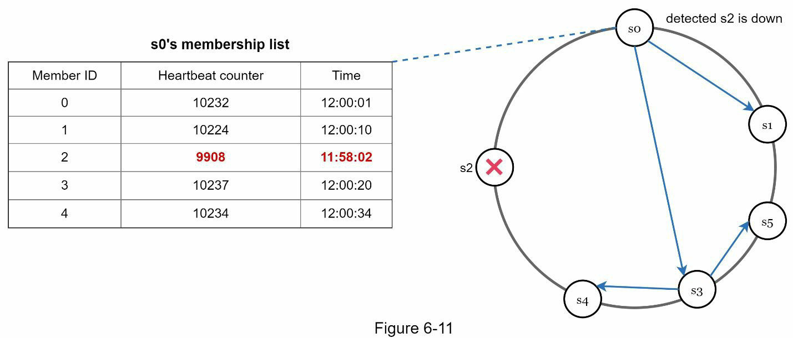

# 제6장: 키-값 저장소 설계

## 키-값 저장소란?
- 비관계형 데이터베이스
- 데이터는 고유한 **키(key)** 와 해당하는 **값(value)** 쌍으로 저장
- 값은 문자열, 리스트, 객체 등 다양한 형태로 가능
- 대표적인 예: **Amazon Dynamo, Memcached, Redis**

### 기본 연산
- `put(key, value)` → 주어진 키에 값 저장
- `get(key)` → 키에 해당하는 값 반환

---

## 단일 서버 키-값 저장소

- 간단한 구현: 메모리 기반 해시 테이블
- 한계점:
    - 메모리는 용량이 제한됨
    - 대규모 데이터 처리에 부적합
- 해결 방법:
    - 데이터 압축
    - 자주 사용하는 데이터만 메모리에 저장
    - 나머지는 디스크에 저장

> ➜ 단일 서버의 한계로 인해 **분산 시스템 설계 필요**

---

## 분산 키-값 저장소 (Distributed Key-Value Store)

- 보통 **분산 해시 테이블(DHT)** 기반
- 핵심 이론: **CAP 이론**

### CAP 이론

- **C (Consistency)**: 모든 노드에서 같은 데이터를 봄
- **A (Availability)**: 일부 노드가 다운되어도 항상 응답
- **P (Partition Tolerance)**: 네트워크 분할에도 시스템은 계속 동작

#### CAP 요약

| 선택 가능한 조합 | 특성                    |
|------------------|-------------------------|
| CP 시스템        | 일관성 + 파티션 허용 → 가용성 희생 |
| AP 시스템        | 가용성 + 파티션 허용 → 일관성 희생 |
| CA 시스템        | 일관성 + 가용성 → 현실적으로 불가능 (파티션 허용 X) |

---

## 예시 상황

- 노드 n1, n2, n3에 데이터 복제
- 네트워크 분할 발생 시, 예: `n3`이 단절됨
- `n3`에 쓰인 데이터가 `n1`, `n2`에 전달되지 않음 → **데이터 불일치 발생**

> ➜ 이때 **일관성(Consistency)** 과 **가용성(Availability)** 중 하나를 선택해야 함

---

## CAP 선택 전략

### CP 시스템 (일관성 우선)
- 예: **은행 시스템**
- 네트워크 분할 시, `n1`, `n2`는 쓰기 차단 → **데이터 불일치 방지**
- 단점: 시스템 일시적 사용 불가, 오류 반환 가능

### AP 시스템 (가용성 우선)
- 시스템은 계속 읽기/쓰기 허용
- 단점: **오래된 데이터(stale data)** 반환 가능
- 네트워크 복구 후 데이터 동기화

> ✔️ 요구사항에 따라 CAP 조합을 적절히 선택해야 함

---

## 시스템 구성 요소

### 1. 데이터 파티셔닝 (Partitioning)
- 데이터를 여러 서버에 분산 저장
- 목표:
    - 서버 간 데이터 고르게 분산
    - 노드 추가/삭제 시 데이터 이동 최소화
- **Consistent Hashing** 활용:
    - 서버와 키를 해시 링에 매핑
    - 키는 시계 방향으로 처음 만나는 서버에 저장
- 장점:
    - 자동 확장 가능
    - 서버 성능에 따라 가상 노드 수 다르게 설정 가능

---

### 2. 데이터 복제 (Replication)
- **N개의 서버**에 데이터 복제 → 고가용성 확보
- 키를 해시 링에 매핑한 후, **시계 방향으로 N개의 서로 다른 서버**에 저장
- 복제본은 **서로 다른 데이터센터**에 분산 배치 → 장애 대응

---

### 3. 일관성 보장: Quorum 방식

- N: 복제본 수
- W: 쓰기 성공을 위해 필요한 응답 수
- R: 읽기 성공을 위해 필요한 응답 수

#### 예시: N = 3

- W = 1 → 최소 한 서버만 응답해도 쓰기 성공
- R = 1 → 최소 한 서버만 응답해도 읽기 성공

> 💡 **W + R > N** 이면 **강한 일관성** 보장

| 설정          | 목적               |
|---------------|--------------------|
| R = 1, W = N   | 빠른 읽기 최적화     |
| W = 1, R = N   | 빠른 쓰기 최적화     |
| W + R > N      | 강한 일관성 보장     |
| W + R ≤ N      | 약한 일관성 또는 최종적 일관성 |

---

## 일관성 모델 (Consistency Models)

| 모델         | 설명                                               |
|--------------|----------------------------------------------------|
| 강한 일관성   | 모든 읽기 → 가장 최근의 쓰기 결과 반환               |
| 약한 일관성   | 최근 쓰기 반영 여부 보장하지 않음                    |
| 최종적 일관성 | 시간이 지나면 모든 복제본이 동일해짐 예: **Dynamo, Cassandra** |

- 강한 일관성: 모든 복제본이 쓰기를 동의할 때까지 읽기/쓰기 차단 → 지연 증가
- 최종적 일관성: 동시 쓰기 허용, 여러 버전 발생 가능 → 클라이언트가 충돌 해결

## 불일치 해결: 버전 관리

### 개요
- 복제는 가용성을 높이지만, 복제본 간 불일치가 발생함.
- 이를 해결하기 위해 **버전 관리(versioning)** 와 **벡터 클럭(vector clock)** 사용.
- 모든 데이터 수정은 변경 불가능한 새로운 버전으로 간주됨.

### 충돌 예시

- 서버 1은 `name`을 `johnSanFrancisco`로, 서버 2는 `johnNewYork`으로 동시에 변경.
- 원래 값은 무시하고, 두 버전(v1, v2) 간 충돌이 발생함.

### 벡터 클럭 (Vector Clock)

- 각 데이터 항목에 `[서버, 버전]` 쌍으로 구성된 벡터 클럭을 저장.
- 벡터 클럭 예시: `D([S1, 2], [S2, 1])`

### 벡터 클럭 업데이트 규칙
1. `[Si, vi]` 항목이 있으면 `vi + 1`
2. 없으면 `[Si, 1]` 추가

### ⚔충돌 감지 예시
- D3: `([Sx, 2], [Sy, 1])`
- D4: `([Sx, 2], [Sz, 1])`
- 공통 조상 D2에서 갈라짐 → 충돌

### 충돌 여부 판단
- **X가 Y의 조상**: Y의 모든 서버 버전 ≥ X
- **X와 Y가 형제**: 어떤 서버의 버전이 X > Y

### 벡터 클럭의 단점
1. 클라이언트가 충돌 해결 로직을 구현해야 함.
2. 벡터 클럭 크기가 커질 수 있음 → 제한 길이 초과 시 오래된 항목 제거 → 정확도 저하 가능

---

## 장애 처리

### 장애 감지

- **Gossip Protocol** 사용:
    - 각 노드는 다른 노드의 ID와 하트비트 카운터를 가진 목록을 유지
    - 주기적으로 하트비트 증가 및 다른 노드에 전파
    - 일정 시간 하트비트 증가가 없으면 해당 노드를 다운으로 간주

### 임시 장애 처리 (Sloppy Quorum + Hinted Handoff)

- 정족수 요구 대신, 현재 살아있는 노드 중 처음 W개, R개 사용
- 장애 노드가 복구되면 대체 노드가 변경사항을 다시 전달 (Hinted Handoff)

### 영구 장애 처리 (Anti-Entropy + Merkle Tree)

- 모든 복제본 비교 및 최신 데이터로 동기화
- **Merkle Tree** 사용: 전체 비교가 아닌 해시 비교로 최소 차이만 동기화

---

## 데이터 센터 장애 대응

- 다중 데이터 센터 간 **데이터 복제**
- 한 센터가 완전히 중단되어도 다른 센터를 통해 데이터 접근 가능

---

## 시스템 아키텍처 요약

### 구조 개요
- 클라이언트는 `get(key)` / `put(key, value)` API를 통해 접근
- **Coordinator 노드**가 클라이언트 요청을 받아 내부 노드에 전달
- **Consistent Hashing** 기반 링 구조
- 각 노드는 동등하며, 자동 확장 가능

---

## Write Path (쓰기 경로)

1. 요청을 **Commit Log**에 기록
2. **메모리 캐시**에 저장
3. 캐시가 가득 차면 **디스크의 SSTable**로 플러시됨
    - SSTable: 정렬된 `<key, value>` 리스트

---

## Read Path (읽기 경로)

1. 메모리 캐시에 데이터가 있으면 즉시 반환
2. 없으면:
    - **Bloom Filter**를 이용해 어느 SSTable에 키가 있는지 추정
    - 해당 SSTable에서 데이터 조회
    - 클라이언트에 결과 반환

# Key-Value Store 설계 목표와 사용 기술 정리

| 목표 / 문제                          | 적용 기술                                                                 |
|------------------------------------|---------------------------------------------------------------------------|
| 대용량 데이터 저장 능력             | Consistent Hashing을 사용하여 서버 간 부하 분산                         |
| 고가용성 읽기 (High Availability)   | 데이터 복제 (Data Replication) 다중 데이터 센터 구성 (Multi-DC Setup) |
| 고가용성 쓰기                       | 벡터 클럭(Vector Clock)을 통한 버전 관리 및 충돌 해결                    |
| 데이터셋 파티셔닝                   | Consistent Hashing                                                       |
| 점진적 확장성 (Incremental Scale)  | Consistent Hashing                                                       |
| 이기종 환경 지원                    | Consistent Hashing                                                       |
| 조절 가능한 일관성 (Tunable Consistency) | 정족수 기반 합의 (Quorum Consensus)                                  |
| 일시적 장애 처리                    | 느슨한 정족수(Sloppy Quorum) + 힌트 핸드오프(Hinted Handoff)           |
| 영구적 장애 처리                    | 머클 트리(Merkle Tree)를 통한 데이터 복구                                |
| 데이터 센터 장애 처리              | 데이터 센터 간 복제(Cross-Data Center Replication)                     |
