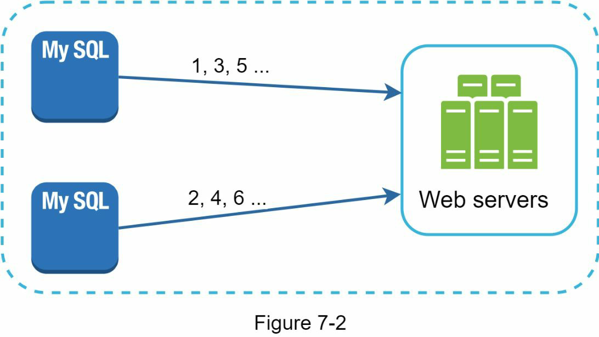
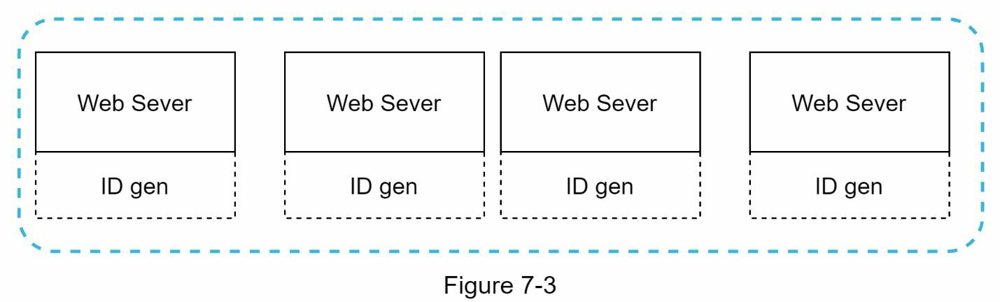
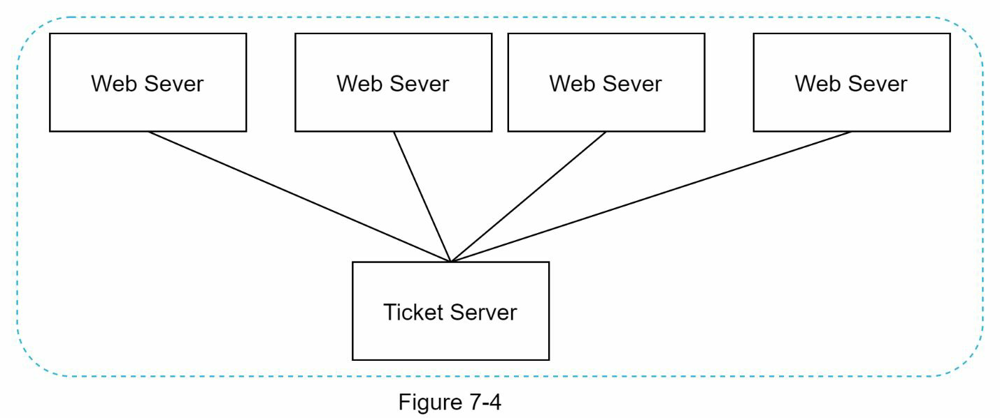
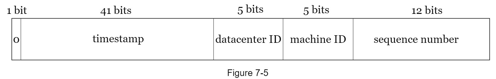
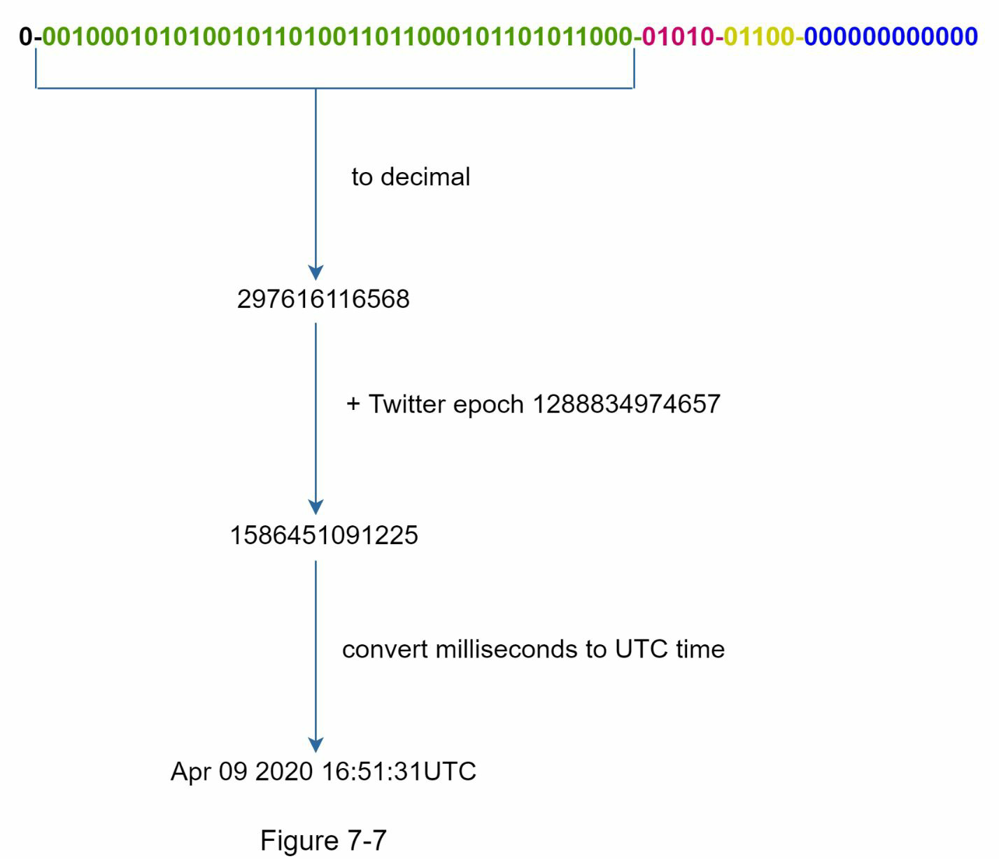

# 7장: 분산 시스템에서 고유 ID 생성기 설계하기

### 왜 `auto_increment`는 분산 환경에 적합하지 않을까?

- 단일 데이터베이스 서버는 확장성에 한계가 있음
- 여러 데이터베이스 인스턴스에서 충돌 없이 **고유 ID를 생성**하는 것은 까다롭고 지연 시간도 큼

따라서 분산 시스템에서는 별도의 **고유 ID 생성 시스템**이 필요

## Step 1 - 문제 이해 및 설계 범위 정의

시스템 설계 인터뷰 문제를 해결하는 첫 번째 단계는 **명확한 요구사항 파악**

### 요구사항 정리:
- ID는 고유해야 함
- 숫자로만 구성됨
- 64비트 내에 들어야 함
- 시간 순으로 정렬 가능해야 함
- 초당 10,000개 이상의 ID 생성 가능

---

## Step 2 - 고수준 설계 및 옵션 비교

고유 ID를 생성할 수 있는 다양한 방식이 있으며, 그중 몇 가지를 살펴봅니다:

- 멀티 마스터 복제 (Multi-master replication)
- UUID
- 티켓 서버 (Ticket Server)
- Twitter Snowflake 방식

### 1. 멀티 마스터 복제

DB의 `auto_increment` 기능을 활용하지만, 1씩 증가하는 대신 **서버 수 k 만큼 증가**  
예: 서버가 2대일 경우, 각 서버는 2씩 증가하는 ID를 생성

#### 단점:
- 여러 데이터센터에 확장하기 어려움
- 서버 간 시간 정렬 보장 안 됨
- 서버 추가/제거 시 문제 발생

---

### 2. UUID

UUID는 128비트 고유 값, 충돌 가능성이 매우 낮음

**장점:**
- 간단하며 서버 간 동기화 불필요
- 독립적 생성이 가능해 확장성 뛰어남

**단점:**
- 128비트이므로 64비트 조건 불충족
- 시간 순 정렬 불가
- 숫자가 아닐 수 있음

---

### 3. 티켓 서버

중앙 DB 서버 하나에서 `auto_increment`를 사용해 ID를 생성

**장점:**
- 숫자 ID
- 구현이 간단하며 소규모에 적합

**단점:**
- 단일 실패 지점 존재
- 고가용성을 위해 다중 서버 구성 시 동기화 문제 발생

---

### 4. Twitter Snowflake 방식

**64비트 ID를 여러 부분으로 나눠 구성**

#### 구조:

| 비트 수 | 설명 |
|--------|------|
| 1비트 | 부호 비트 (항상 0) |
| 41비트 | 타임스탬프 (ms 단위) |
| 5비트 | 데이터센터 ID (최대 32개) |
| 5비트 | 머신 ID (데이터센터당 32대) |
| 12비트 | 시퀀스 번호 (1ms 내 최대 4096개) |

---

## Step 3 - 상세 설계

### 타임스탬프 (41비트)

- epoch 기준 ms 단위 시간값
- Twitter는 `1288834974657`을 기준 (2010년 11월 4일)
- **69년** 동안 사용 가능 (`2^41 - 1` ms)

### 시퀀스 번호 (12비트)
- 1ms 동안 하나의 머신에서 생성된 ID 수를 의미
- 최대 4096개
- 매 ms마다 0으로 리셋됨
