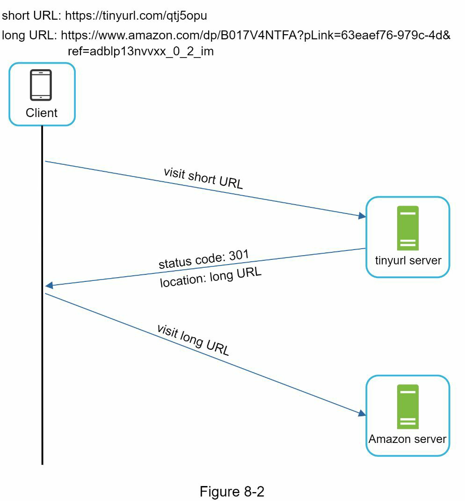

# CHAPTER 8: URL 단축기 설계하기

## Step 1 - 문제 이해 및 설계 범위 정의

### 기본 기능 요구사항

1. **URL 단축:** 긴 URL을 입력하면 짧은 URL을 반환
2. **URL 리다이렉트:** 짧은 URL을 통해 원래 URL로 리다이렉션
3. **고가용성, 확장성, 장애 허용성** 고려

---

## 간단한 추정 (Back-of-the-envelope Estimation)

- **쓰기 요청:** 하루 1억 개 URL → 초당 약 1,160개의 쓰기 요청
- **읽기 요청:** 읽기:쓰기 비율을 10:1로 가정하면 → 초당 약 11,600개의 읽기 요청
- **총 데이터:** 10년 간 운영 시 → 365억 * 10 = **3,650억 개의 URL**
- **저장소 용량:** 평균 URL 길이를 100바이트로 가정 →  
  3,650억 * 100바이트 = **36.5TB**의 저장 공간 필요

---

## Step 2 - 고수준 설계 및 API 흐름

## 헤더


## 리다이렉션 동작 방식


- 사용자가 `https://tinyurl.com/y7keocwj` 입력
- 서버는 이를 원래 URL로 매핑하여 **리다이렉트** 수행
- 리다이렉션 방식:
    - **301 Redirect:** 영구 리다이렉트, 브라우저가 캐시함
    - **302 Redirect:** 임시 리다이렉트, 클릭 추적에 유리

**기본 구현:** 해시 테이블 사용
```python
longURL = hashTable.get(shortURL)
```

---

## URL 단축 방식

단축 URL 형태: `https://tinyurl.com/{hashValue}`

### 해시 함수 조건

- 각 longURL → 하나의 hashValue로 매핑
- 각 hashValue → longURL로 역매핑 가능해야 함

---

## Step 3 - 심화 설계

### 데이터 모델

메모리만 사용하는 해시 테이블은 비현실적이므로, **관계형 데이터베이스**를 사용

| id | shortURL     | longURL                                |
|----|--------------|-----------------------------------------|
| 1  | 2TX          | https://en.wikipedia.org/wiki/...       |

---

### 해시 값 길이 계산

사용 가능한 문자 수: `62` (0-9, a-z, A-Z)

지원해야 할 URL 수: `3650억 (3.65 * 10^11)`  
가장 작은 n값 찾기: `62^n ≥ 3650억`  
→ `n = 7`일 때 `62^7 ≈ 3.5조`로 충분

**해시 길이 = 7자**

---

## 해시 함수 설계

### 방법 1: 해시 + 충돌 해결

- SHA-1, MD5, CRC32 등을 활용해 해시 생성


- 앞 7자리 사용 + 충돌 시 다른 문자열 덧붙이기
- 충돌 확인은 데이터베이스 또는 **블룸 필터(Bloom Filter)** 사용

### 방법 2: Base62 변환

- 고유 숫자 ID → Base62 문자열로 변환
- 62진수 문자 매핑:
    - 0-9: '0'-'9'
    - 10-35: 'a'-'z'
    - 36-61: 'A'-'Z'

#### 예시
- 고유 ID: `11157` (10진수)
- Base62 변환: `11157 = 2×62^2 + 55×62 + 59 = [2, 55, 59]`
- Base62 문자열: `2TX`

---

## URL 단축 플로우 (Base62 방식 사용)

1. 사용자가 longURL을 입력
2. DB에서 이미 존재하는지 확인
3. 있으면 기존 shortURL 반환
4. 없으면:
    - 고유 ID 생성
    - Base62로 변환
    - DB에 저장 후 shortURL 반환

#### 예시
- 입력: `https://en.wikipedia.org/wiki/Systems_design`
- ID 생성기: `2009215674938`
- Base62 변환: `zn9edcu`
- 저장:

 | id            | shortURL | longURL                                    |
  |---------------|----------|---------------------------------------------|
  | 2009215674938 | zn9edcu  | https://en.wikipedia.org/wiki/Systems_design |

---
### Hash + 충돌 해결 vs Base 62 변환 방식 비교

| 항목 | Hash + 충돌 해결 | Base 62 변환 |
|------|--------------------|------------------|
| **짧은 URL 길이** | 고정된 길이 | ID 값에 따라 길이가 달라짐 |
| **Unique ID 필요 여부** | 필요 없음 | Unique ID Generator 필요 |
| **충돌(Collision)** | 충돌 가능, 해결 필요 | 충돌 없음 (ID가 유일하기 때문) |
| **예측 가능성** | 다음 short URL 예측 불가 (ID에 의존하지 않음) | ID가 1씩 증가하면 다음 URL 예측 가능<br>→ **보안 취약점** 가능성 있음 |

## URL 리다이렉트 심화

리다이렉트 요청은 **읽기**가 많기 때문에 **캐시를 적극 사용**

### 동작 흐름

1. 사용자가 `tinyurl.com/zn9edcu` 클릭
2. 로드 밸런서가 웹 서버로 요청 전달
3. 캐시에 있으면 → 바로 longURL 반환
4. 캐시에 없으면 → DB에서 longURL 조회
5. longURL 반환 및 HTTP 리다이렉트 수행

---