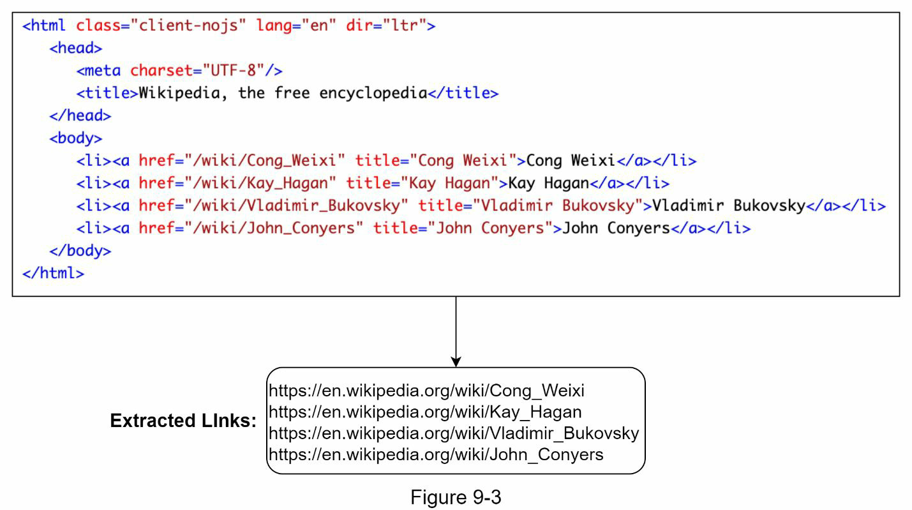
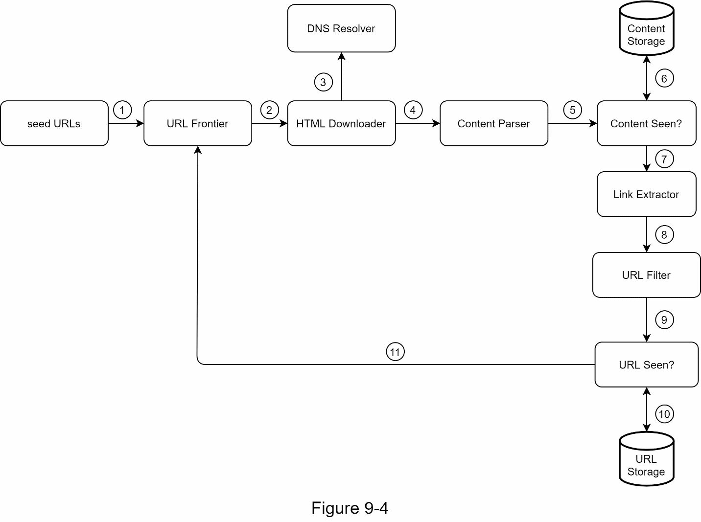
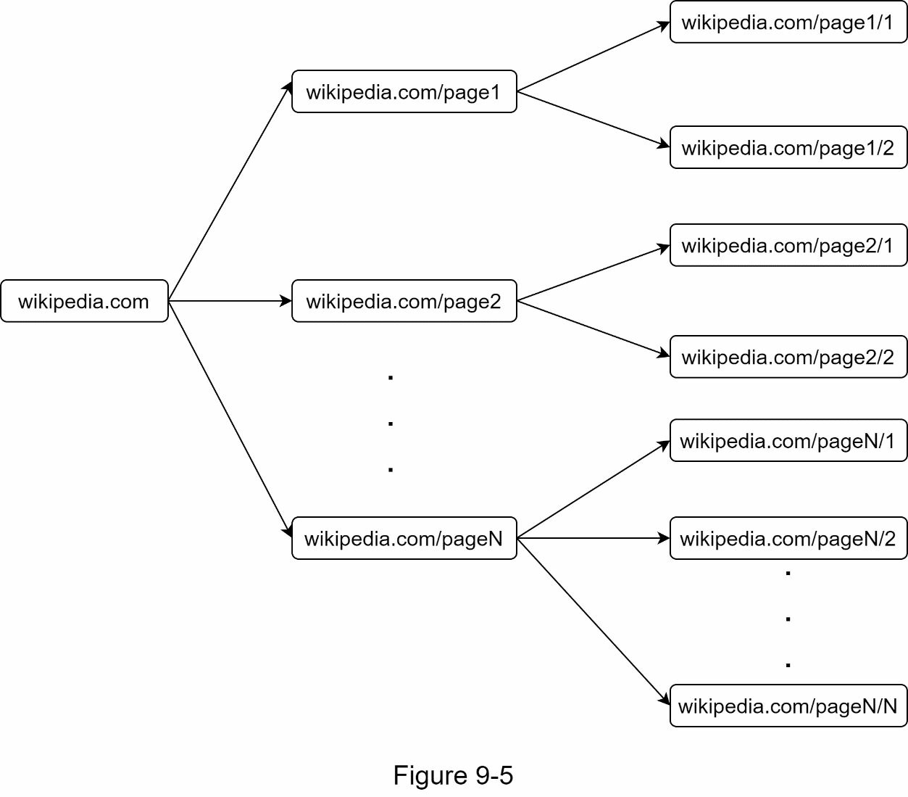
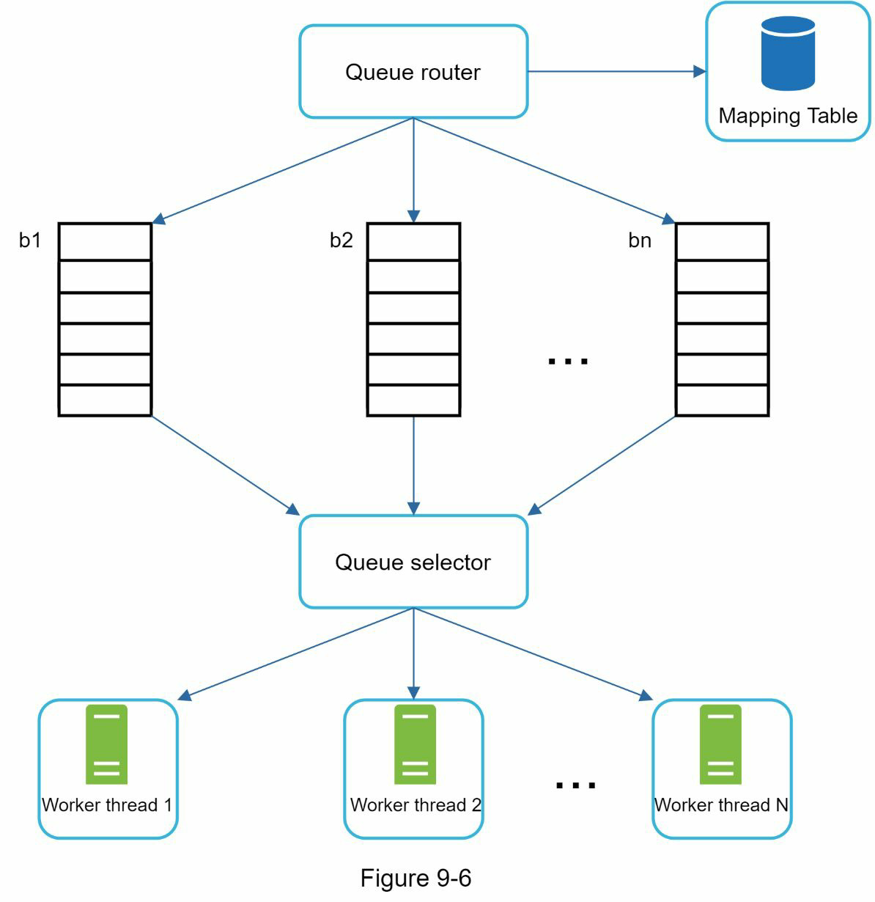
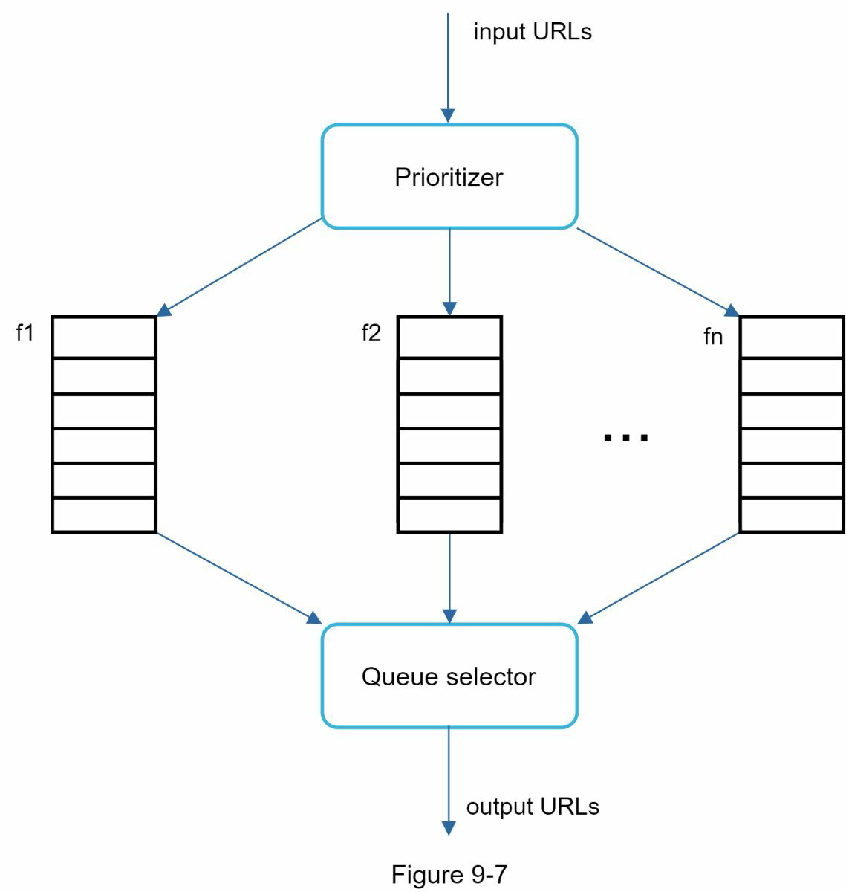
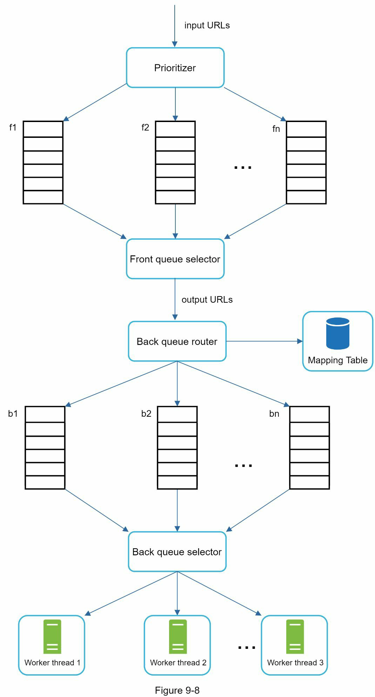
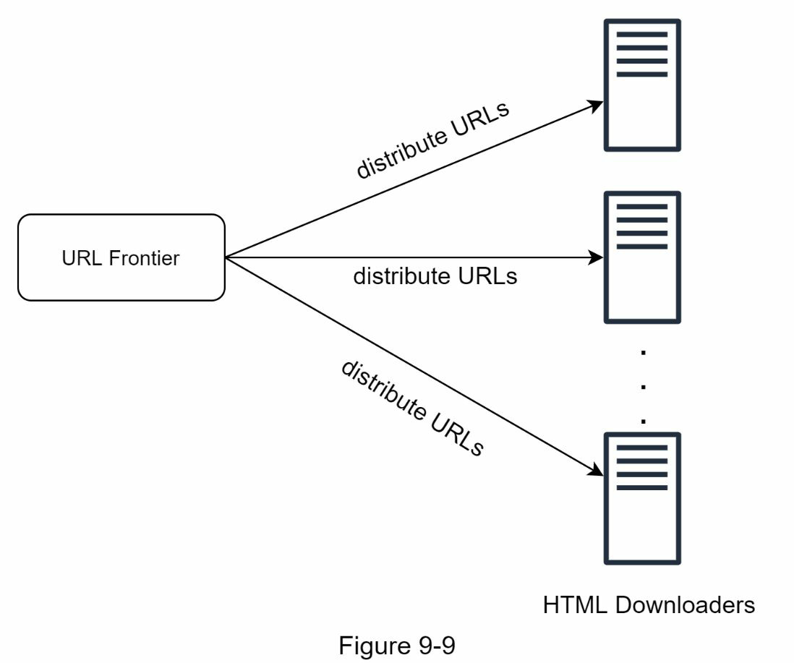
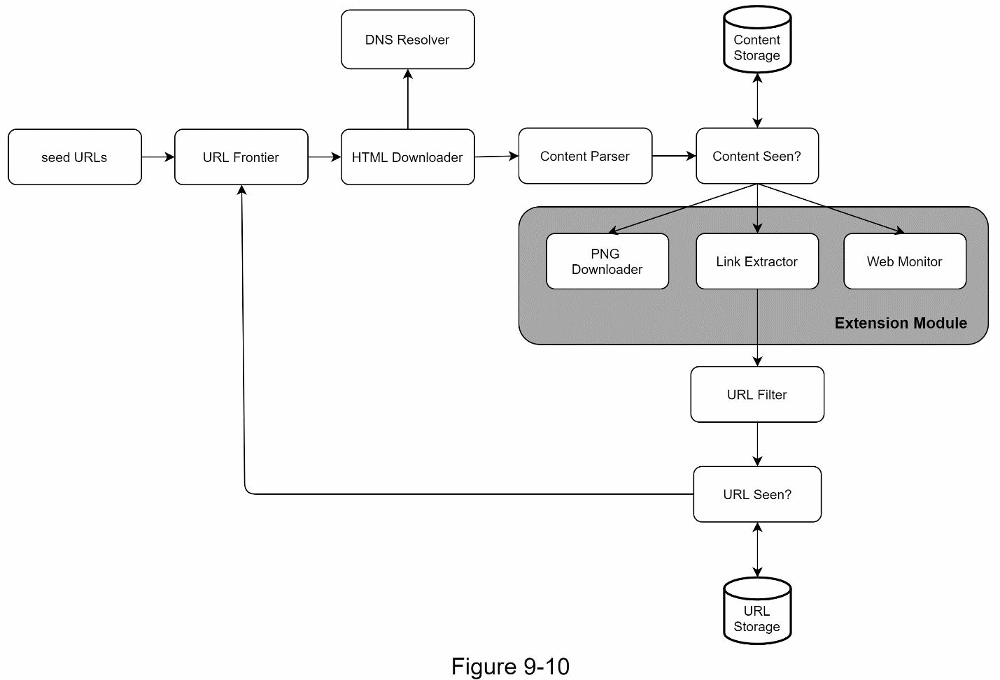

# Chapter 9: 웹 크롤러 설계

웹 크롤러(Web Crawler)는 **로봇(Robot)** 또는 **스파이더(Spider)** 라고도 불리며, 검색 엔진이 웹상의 새로운 콘텐츠를 발견할 때 주로 사용된다. 크롤러는 몇 개의 웹 페이지에서 시작하여 링크를 따라가며 새로운 콘텐츠를 수집한다.

## 웹 크롤러의 주요 활용 사례

- **검색 엔진 색인화 (Search Engine Indexing)**
    - 가장 일반적인 사용 사례
    - 크롤러는 웹 페이지를 수집하여 검색 엔진의 로컬 인덱스를 생성
    - 예: Google의 Googlebot

- **웹 아카이빙 (Web Archiving)**
    - 미래를 위해 웹 정보를 수집 및 보존
    - 예: 미국 의회 도서관, EU 웹 아카이브

- **웹 마이닝 (Web Mining)**
    - 웹 상의 방대한 데이터를 분석해 유용한 정보를 추출
    - 예: 금융 회사들이 주주총회 자료나 연례 보고서를 분석

- **웹 모니터링 (Web Monitoring)**
    - 저작권 및 상표 침해 감시
    - 예: Digimarc는 불법 복제물을 탐지하여 보고

## 복잡성과 확장성

웹 크롤러의 개발 난이도는 **지원 규모**에 따라 다양함:

- **소규모 프로젝트**: 몇 시간 만에 완성 가능한 수준 (예: 학교 과제)
- **대규모 시스템**: 전문 엔지니어링 팀이 지속적으로 개선해야 하는 복잡한 구조

# 🧠 Step 1 - 문제 이해 및 설계 범위 정의

웹 크롤러의 기본 알고리즘은 단순해 보입니다:

1. URL 목록을 받아 해당 웹 페이지를 다운로드
2. 웹 페이지에서 새로운 URL 추출
3. 새로운 URL을 다시 다운로드 목록에 추가하고 반복

하지만 **실제 대규모 크롤러 설계는 매우 복잡**하며, 인터뷰 시간 안에 완전한 시스템을 설계하기는 어렵습니다. 따라서 설계 전에 **요구사항을 명확히 파악하고 범위를 정의**하는 것이 중요합니다.

## 예시 인터뷰어 응답

- 검색 엔진 인덱싱용

- 월간 크롤링 웹 10억 페이지

- 콘텐츠 유형 HTML만 (PDF, 이미지 제외)

- 신규/수정된 페이지도 포함

- 크롤링한 HTML 최대 5년간 저장

- 중복 콘텐츠는 무시

## 좋은 웹 크롤러의 특성

- **Scalability (확장성)**
    - 수십억 개의 페이지를 효율적으로 병렬 처리해야 함

- **Robustness (견고성)**
    - 잘못된 HTML, 응답 없음, 충돌, 악성 링크 등 다양한 오류 상황을 견딜 수 있어야 함

- **Politeness (공손함)**
    - 특정 웹사이트에 단시간에 과도한 요청을 하지 않아야 함

- **Extensibility (확장 가능성)**
    - 시스템을 크게 변경하지 않고 이미지 등 다른 콘텐츠 유형을 지원할 수 있어야 함

## 대략적인 수치 추정 (Back-of-the-envelope Estimation)

- **월간 크롤링 수**: 10억 페이지
- **초당 처리량 (QPS)**:
    - 평균 QPS: 1,000,000,000 ÷ 30 ÷ 24 ÷ 3600 ≈ 400
    - 피크 QPS: 약 800

- **웹 페이지 평균 크기**: 500KB
- **월간 저장소 사용량**:
    - 10억 페이지 x 500KB = **500TB**

- **5년간 저장시 총 용량**:
    - 500TB × 12개월 × 5년 = **30PB**

# Step 2 - 상위 수준 설계 제안 및 합의 도출

## 구성 요소 설명

### Seed URLs (시드 URL)
- 크롤링의 시작점이 되는 URL들
- 예: `https://www.university.edu`
- 전체 웹 크롤링 시에는 **국가별**, **주제별(쇼핑, 스포츠 등)** 로 URL 공간을 나누는 전략 사용

---

### URL Frontier (URL 프론티어)
- 아직 다운로드되지 않은 URL 목록 저장
- 일반적으로 **FIFO 큐** 사용

---

### HTML Downloader (HTML 다운로더)
- URL Frontier에서 받은 URL로부터 HTML 페이지 다운로드

---

### DNS Resolver
- URL을 IP 주소로 변환 (예: `www.wikipedia.org` → `198.35.26.96`)

---

### Content Parser (콘텐츠 파서)
- 다운로드된 HTML을 파싱하고 유효성 검사
- 오류가 있는 페이지나 비정상적인 콘텐츠 필터링

---

### Content Seen
- 중복 콘텐츠 판별용 데이터 구조
- **해시(hash)** 기반 비교 방식 사용
- 중복된 경우 저장하지 않음

---

### Content Storage
- HTML 콘텐츠 저장소
- **디스크**: 대부분의 데이터 저장
- **메모리**: 자주 요청되는 인기 콘텐츠 저장 (낮은 지연 시간)

---

### URL Extractor
- HTML에서 하이퍼링크 추출
- 상대 경로 → 절대 경로로 변환 (`/wiki/URL` → `https://en.wikipedia.org/wiki/URL`)

---

### URL Filter
- 특정 파일 유형, 오류 링크, 블랙리스트 URL 제외

---

### URL Seen
- 중복 URL 판별용 데이터 구조
- 이미 방문했거나 Frontier에 있는 URL이면 제외
- 구현 예시: **Bloom Filter**, **Hash Table**

---

### URL Storage
- 이미 방문한 URL 저장

---

## 전체 웹 크롤러 워크플로우

1. 시드 URL을 URL Frontier에 추가
2. HTML Downloader가 URL Frontier에서 URL을 요청
3. DNS Resolver를 통해 IP 주소 조회 → HTML 다운로드 시작
4. Content Parser가 HTML 파싱 및 유효성 검사 수행
5. Content Seen?을 통해 중복 콘텐츠 여부 확인
    - 중복 시 폐기
    - 새 콘텐츠일 경우 URL Extractor로 전달
6. URL Extractor가 HTML에서 링크 추출
7. URL Filter를 통해 불필요한 URL 필터링
8. URL Seen?을 통해 중복 URL 확인
9. 새로운 URL만 URL Frontier에 추가

# Step 3 - 설계 심화 분석 (Design Deep Dive)

상위 수준 설계를 마친 후, 다음은 웹 크롤러의 핵심 구성요소들과 주요 기술들을 상세히 살펴보는 단계입니다.

---

## DFS vs BFS (깊이 우선 vs 너비 우선 탐색)
- **DFS**: 깊이 탐색 → 너무 깊이 들어갈 수 있어 비효율적
- **BFS**: 일반적으로 사용됨 → **FIFO 큐** 사용
  - **단점**:
    1. 동일 호스트 내 링크가 많아 편향된 크롤링 발생
    2. URL의 중요도(페이지 랭크 등)를 고려하지 않음

---

## URL Frontier (URL 프론티어)

크롤링의 핵심 큐 시스템. 다음과 같은 목적에 맞게 설계됨:

### 1. Politeness (정중함)
- 동일 호스트에 과도한 요청 → 서버 과부하, DoS로 오해 가능
- 해결책:
  - 각 호스트마다 별도의 FIFO 큐 사용
  - 다운로드 간 **지연 시간(delay)** 설정
  - **Queue Router**와 **Queue Selector**를 이용해 분산 처리

### 2. Priority (우선순위)
- URL마다 중요도 다름 → Apple 포럼 글 < Apple 공식 홈페이지
- **Prioritizer**를 통해 URL 우선순위 계산 (예: PageRank, 트래픽, 업데이트 빈도 등)
- 높은 우선순위 큐가 더 자주 선택되도록 **biased random selection** 수행

### 3. Freshness (신선도)
- 웹은 항상 변화 중 → 주기적 재방문 필요
- 전략:
  - 페이지 변경 이력 기반 재크롤링
  - 중요한 페이지를 더 자주 재방문

### 4. 저장 전략
- 수억 개 URL 처리 필요 → **하이브리드 방식**
  - 디스크: 대규모 저장
  - 메모리: 큐 버퍼 역할 (enqueue/dequeue용)

---

## HTML Downloader

웹 페이지를 다운로드하는 컴포넌트.

### robots.txt 처리
- 크롤링 허용/비허용 경로 명시
- 예: `Disallow: /creatorhub/*`
- 결과는 **캐시**에 저장하여 중복 다운로드 방지

### 성능 최적화

1. **분산 크롤링**: 여러 서버/스레드 사용, URL 공간 분할

2. **DNS 캐시**: 느린 DNS 응답 방지, 주기적 갱신
3. **지리적 분산(Locality)**: 웹 서버와 가까운 위치에서 크롤링
4. **짧은 타임아웃 설정**: 응답이 느린 서버는 건너뛰기

---

## Robustness (강건성)

- **Consistent Hashing**: 서버 추가/삭제 시 로드 균형 유지
- **크롤 상태 저장**: 중단 후 재시작 가능
- **예외 처리**: 시스템 전체 크래시 방지
- **데이터 유효성 검사**: 오류 방지

---

## Extensibility (확장성)

- 시스템이 진화할 수 있도록 **모듈화 설계**
- 예:
  - PNG 다운로드 모듈 추가
  - 웹 감시 모듈 (저작권, 상표 침해 방지)

---

## Problematic Content Handling

### 1. 중복 콘텐츠
- 전체 웹의 약 30%가 중복
- **해시/체크섬** 비교로 제거

### 2. Spider Traps
- 무한 디렉토리 링크 등으로 인해 크롤러가 빠질 수 있음
- 대응:
  - URL 길이 제한
  - 수동 필터링 적용

### 3. 데이터 노이즈
- 광고, 코드 조각, 스팸 링크 등 → 제외 필요

# Step 4 - 마무리 (Wrap up)

## 좋은 웹 크롤러의 핵심 특성

1. **Scalability (확장성)**  
   → 대규모 웹 환경에서도 효율적으로 동작 가능해야 함

2. **Politeness (정중함)**  
   → 특정 웹사이트에 과도한 부하를 주지 않도록 조절

3. **Extensibility (확장 가능성)**  
   → 새로운 콘텐츠 타입이나 모듈을 쉽게 추가 가능

4. **Robustness (견고성)**  
   → 장애, 오류 상황에서도 안정적으로 동작

---

## 핵심 설계 요소 요약

- **URL Frontier**: 정중함, 우선순위, 신선도를 모두 관리하는 큐 구조
- **HTML Downloader**: robots.txt, 성능 최적화, 분산 처리
- **Content Filtering**: 중복, 스팸, 함정 페이지 등을 식별/제거
- **Storage System**: 하이브리드 저장, 데이터 유효성 및 상태 저장

---

## 추가 고려 사항

웹 크롤링 시스템의 품질을 한층 높이기 위한 심화 주제들:

### 1. Server-Side Rendering (서버 측 렌더링)
- JavaScript, AJAX로 생성된 **동적 링크** 처리 필요
- 해결책: **렌더링 후 파싱**

### 2. Low-Quality / Spam Filtering
- 저장 공간과 크롤 자원이 한정적이므로, **스팸/저품질 페이지**는 제외
- Anti-spam 모듈 도입

### 3. DB Replication & Sharding
- 데이터 계층의 **가용성, 확장성, 신뢰성** 향상을 위해 필수

### 4. Horizontal Scaling (수평 확장)
- 대규모 시스템 → 수백~수천 대 서버 필요
- 핵심: **서버 stateless** 유지

### 5. Availability, Consistency, Reliability
- 분산 시스템의 기본 원칙
- (1장 내용 복습 추천)

### 6. Analytics (분석 기능)
- 크롤링 로그, 성능 지표 수집
- 데이터 기반 시스템 최적화 가능
